## Homework1 Report

###  开发环境

* Mac OS
* Objective-C
* Xcode

### 实验过程（根据tutorial完成）
1、打开XCode，创建新的项目

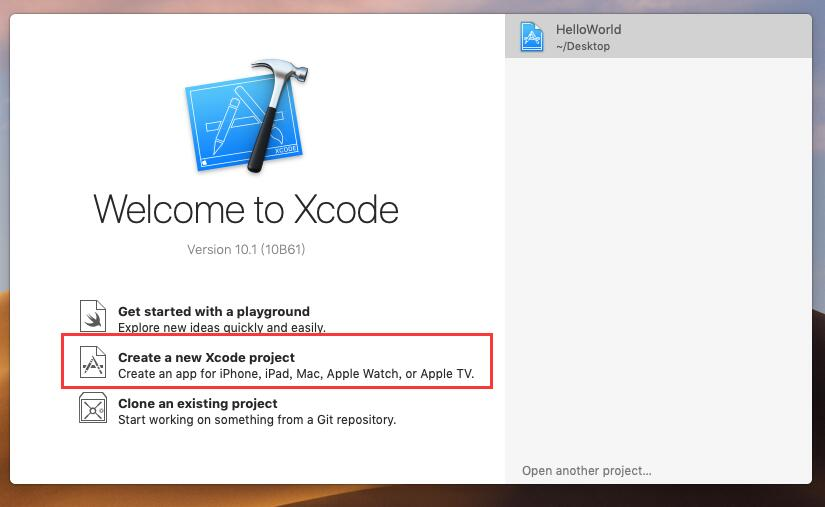

选择Single View App模式

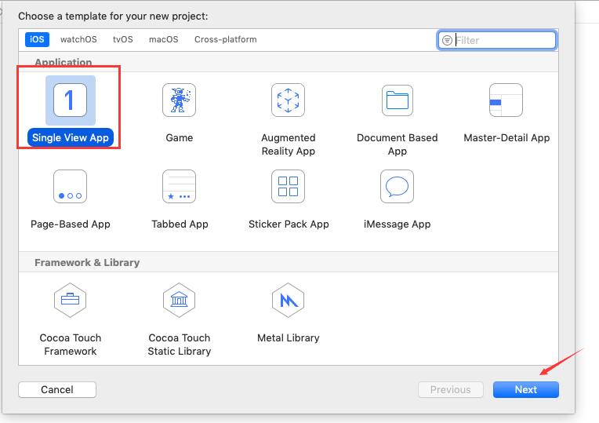

2、填写项目的基本信息

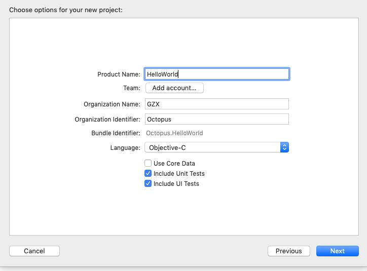

3、选择项目存放位置（是否勾选创建Git repository，默认即可，是一个版本控制器，适合多人协作开发）

4、在HelloWorld文件夹中找到info.plist，双击打开，找到Main.storyboard，点击有 - 符号的小圆圈进行删除

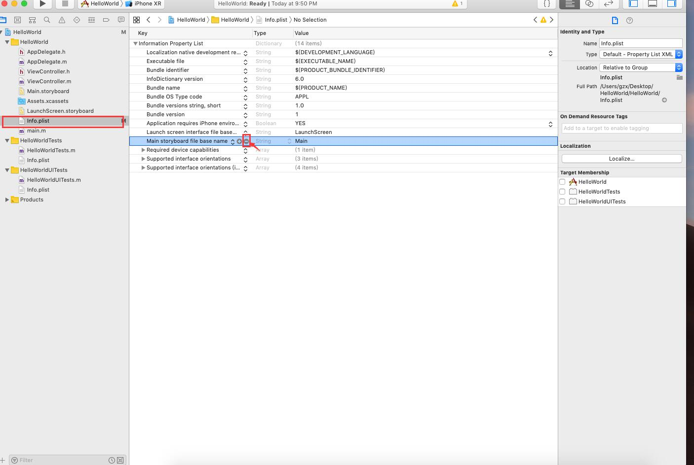

并且清除info.plist配置文件中的入口

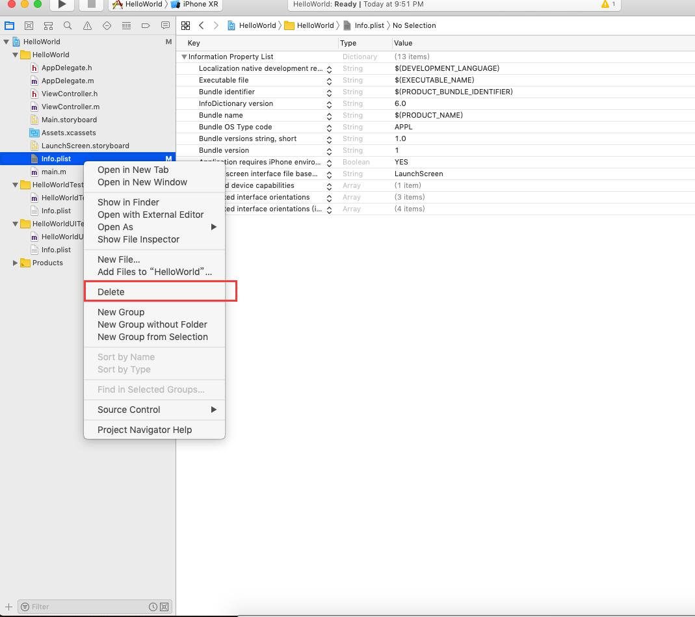

点击Delete后，选择移除引用

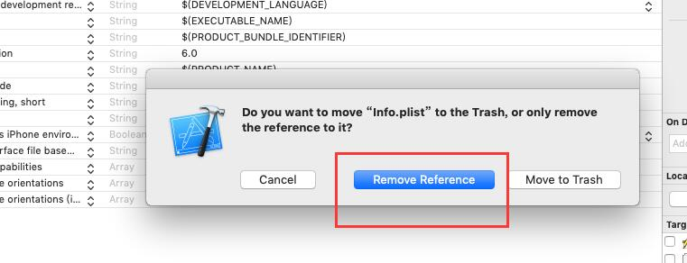

5、根据tutorial给出的代码，填入文件`AppDelegate.m`中

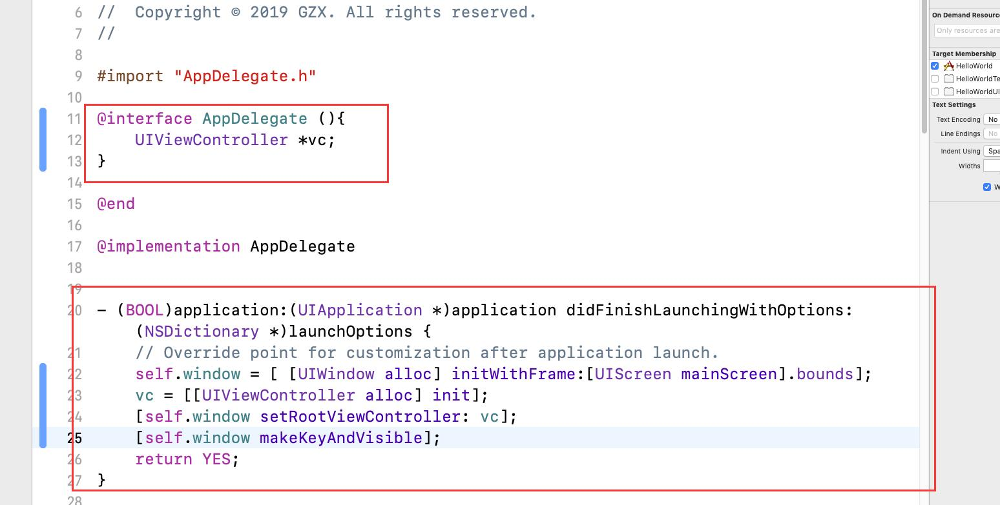

6、根据tutorial给出的代码，填入文件`ViewController.m`中

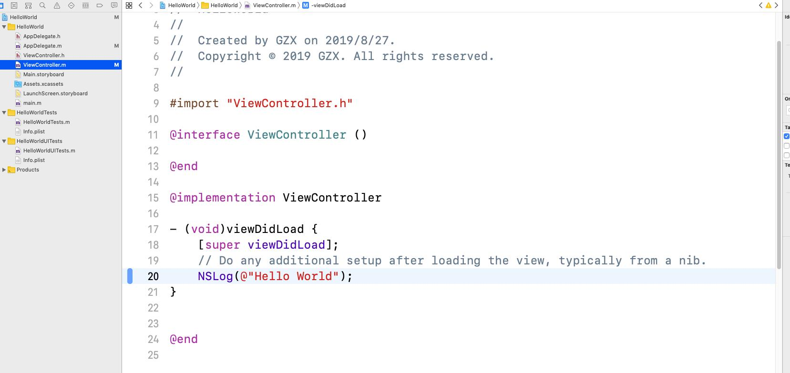

7、点击左上角的三角形执行代码

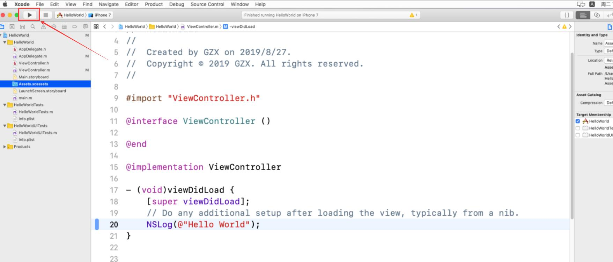

### 实验结果
控制台没有输出tutorial给出的理想结果，在网上搜索了控制台的输出，还是没找到解决办法，由于现在还不懂得Object C，所以不知所以然。

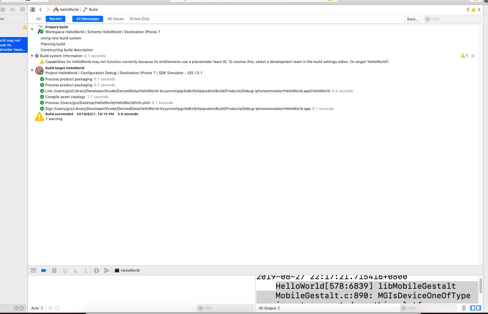

后来再看了tutorial的代码，发现导致这个错误的原因是：在文件`AppDelegate.m`没有import文件`ViewController.h`，这也解释了为什么我一开始打ViewControll的时候，XCode显示我有错误，对着tutorial再次修改一下代码

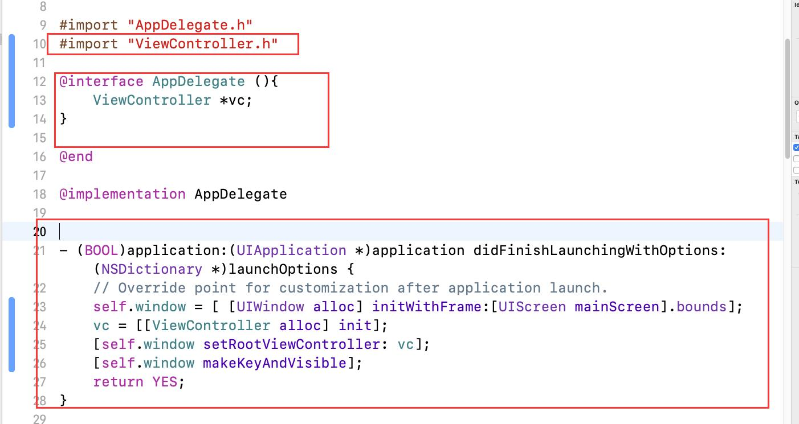

点击执行，可以看到控制台输出了“Hello world”

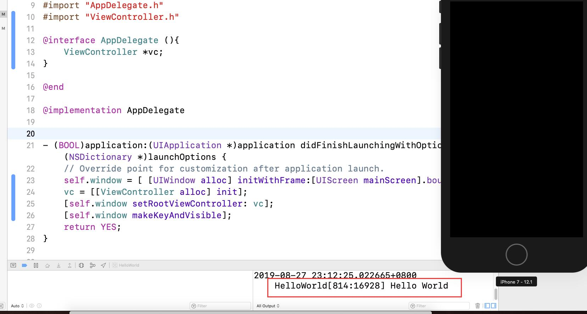
