## Homework2 Report

### 介绍

个人作业2-面向对象与Objective-C语法学习

###  开发环境

* Mac OS
* Objective-C
* Xcode

DeadLine: 9月15日23:59 

### 第二周任务

### 面向对象与Objective-C语法学习

---

### 实验目的

1. 学习掌握Objective-C语法，掌握基础字符串操作。
2. OO知识——多态与继承

### 实验内容

给定三个用户张三，李四，王五。

给定四种语言英语、日语、德语、西班牙语。

实现场景输出（log形式即可）：随机选择一个用户和一种语言学习，从**当前日期**开始，随机产生时间进行学习，输出学习进度直至学习完毕。每个语言共8个tour，每个tour共4个unit，每次学习一个unit。

要求：

- 随机选定人名、语言后，一次性输出所有的结果。
- 随机时间指的是每次随机1-5天，每次学习时间在前一次的基础上加上刚刚随机出的天数。
- 需要用到多态。

输出例子： 张三 某年某月某日 学习日语 tour 1 unit 1。

### 实验代码
首先新建了Person.h文件，定义了一个字符串类型的属性name，并使用@property，让编译器自动帮我们生成getter和setter函数接口。
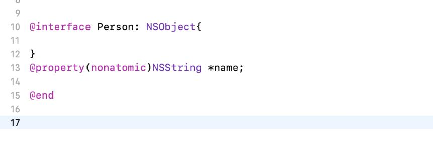
 
然后新建一个Person.m文件，来实现Person类的方法，使用@synthesize让编译器自动帮我们生成getter和setter函数，然后写了一个构造函数，通过随机数的形式赋予不同的名字。
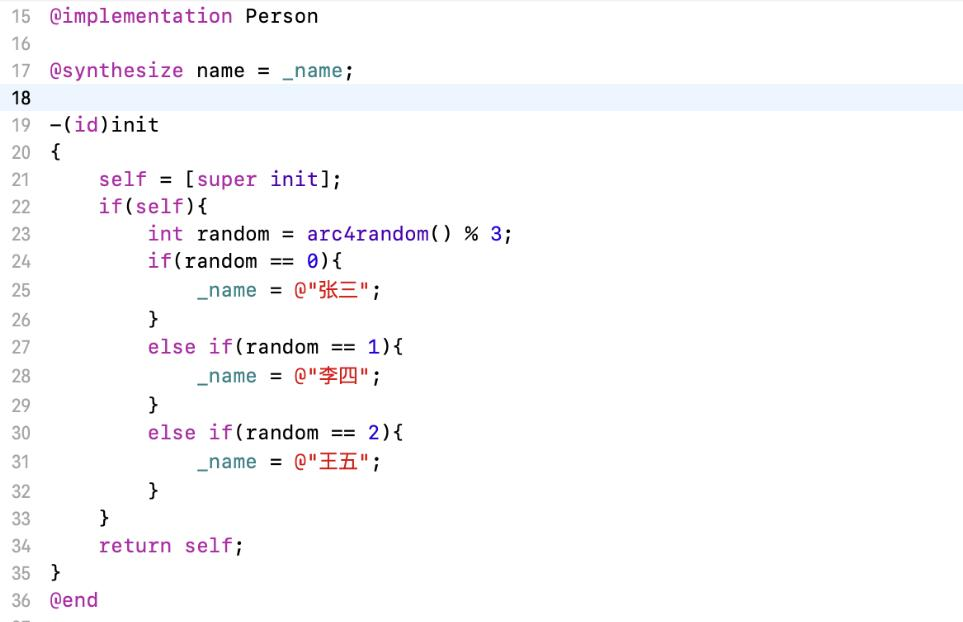
 
接着新建一个Lesson.h文件，定义了学习语言的属性，包括语言名称，当前学到的tour及unit，还有学习该单元的日期，这四个都使用@property。
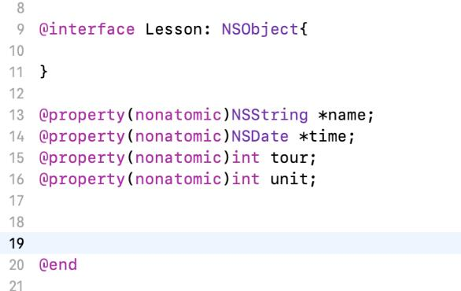
 
新建一个Lesson.m文件，与Person.m类似，使用@synthesize。
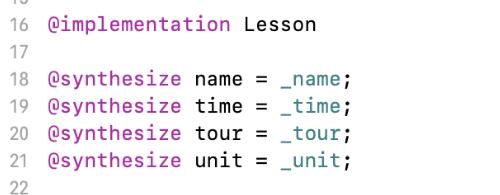
 
Lesson的构造函数，也是使用随机数的形式赋予不同的课程名字，并将time设为运行时的系统时间，tour和unit都初始化为1。
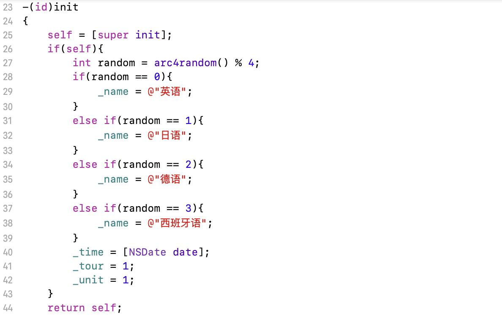
 
最后再来看下主程序调用的函数，获得Person和Lesson的实例，并给定显示时间的格式，然后调用for循环输出语句，每次输出完后，时间更新到本次时间加上随机的间隔时间，unit加1，若unit到达4以后，则unit重置为1，tuor加1。
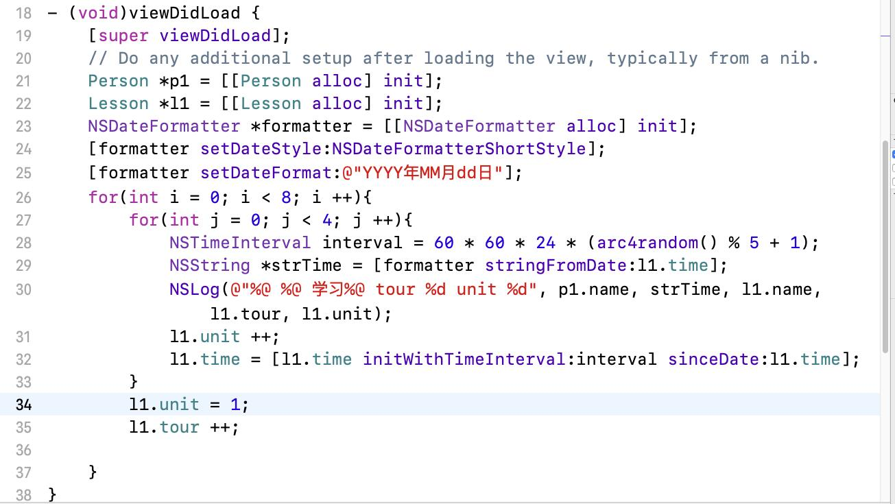
 
## 更新
 后来发现TA给了一个Language.h的文件，让我们实现多态，所以在这里解释一下后来更改的代码
首先看一下Language.h文件，TA给定了学习一个单元、获取当前学习的Tour、获取当前学习的unit，判断是否学习完毕，获取课程名称这五个函数，以及四门外语的接口，都继承Language。我们需要在Language.m文件中，实现这个五个函数。
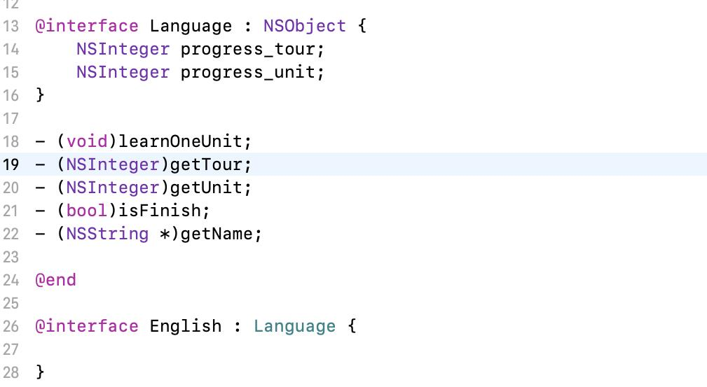
 
首先在Language.m文件中，实现Language的构造函数，只需将unit和tour初始化为0即可。
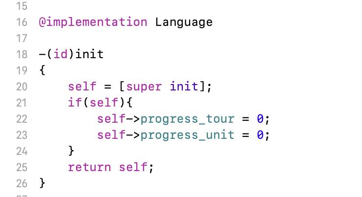
 
然后是学习一个单元的函数，unit和tour改变的条件是：如果unit还没达到4，则tour不变，unit加1；如果unit达到了4，则tuor加1，unit重置为1。 tour、unit的getter函数都比较简单，直接返回其值即可。
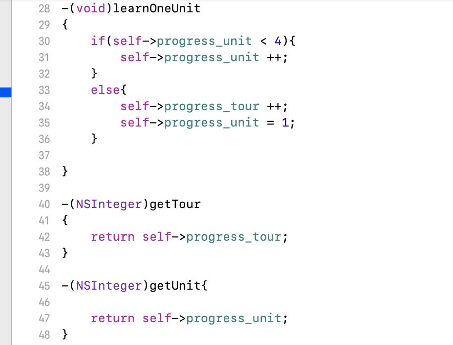
 
Language的getName函数，我做的是返回nil处理，因为此时还不确实是哪一门外语课程。isFinish函数，判断一门课程是否学完的条件就是Tour是否为8且Unit是否为4.
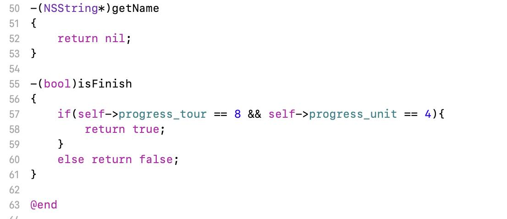
 
四门外语类都相似，首先init函数直接调用父类的init即可。然后getName函数返回对应的语言名称字符串即可。
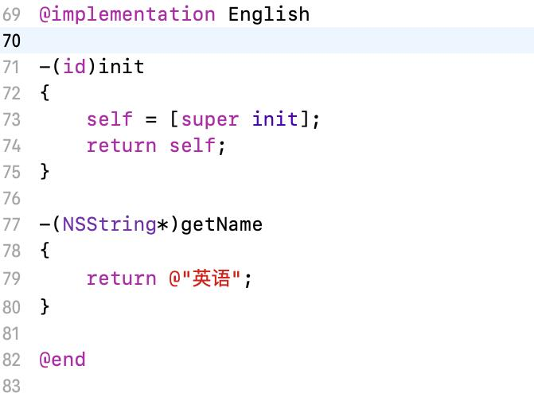
 
最后来看看main函数调用的函数如何写。基本与我一开始写的类似，比较不同的是，一开始分别实例化了四门外语课的对象，并实例化一个Language类的对象，然后根据随机数的值，将外语课对象赋值给Language的对象
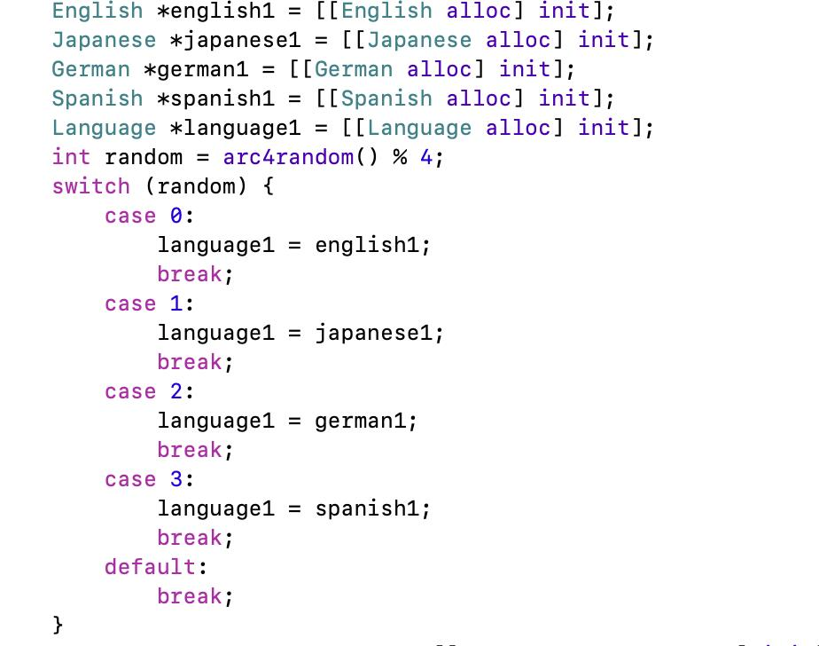
 
开始学习前，获得当前的系统时间，学习过程就是，当isFinish为假的时候，一直学下去。
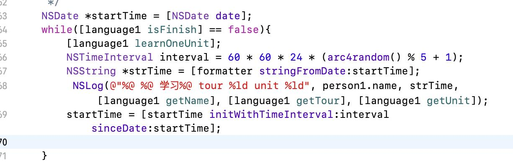
 
### 测试结果
测试结果1：
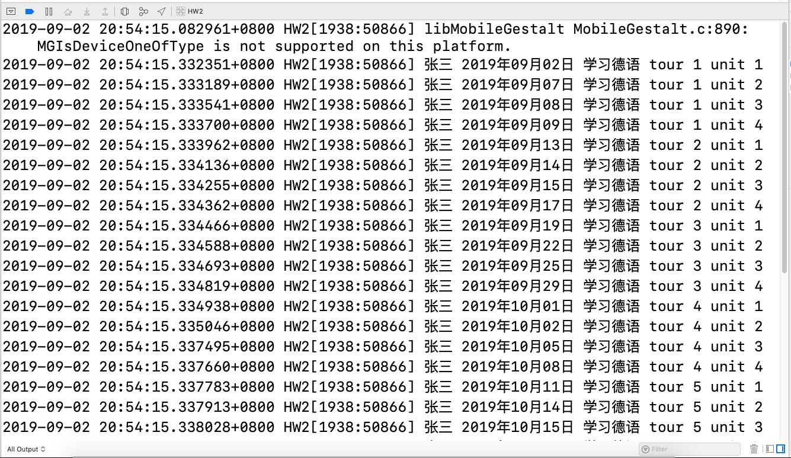
 
测试结果2：
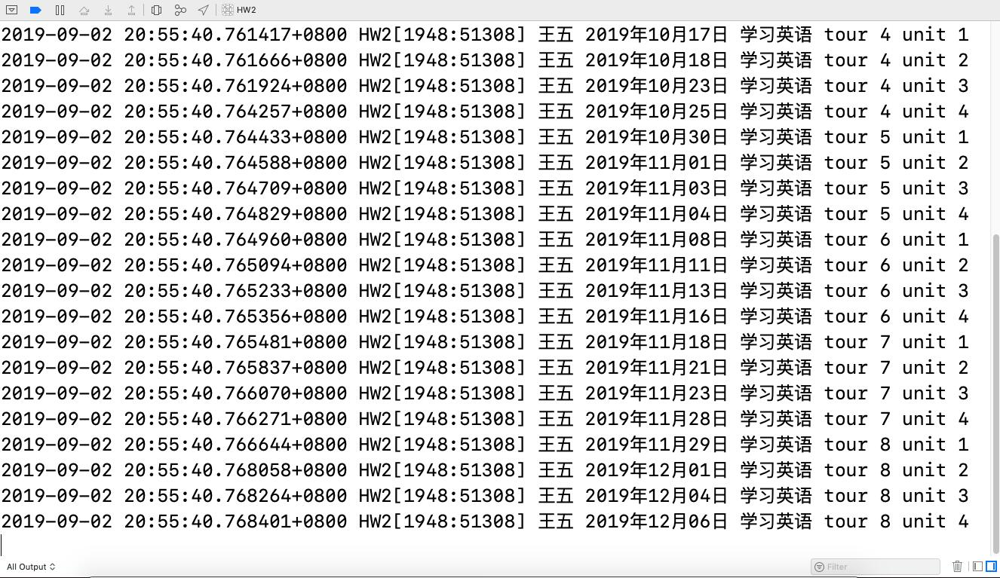
 
测试结果3：
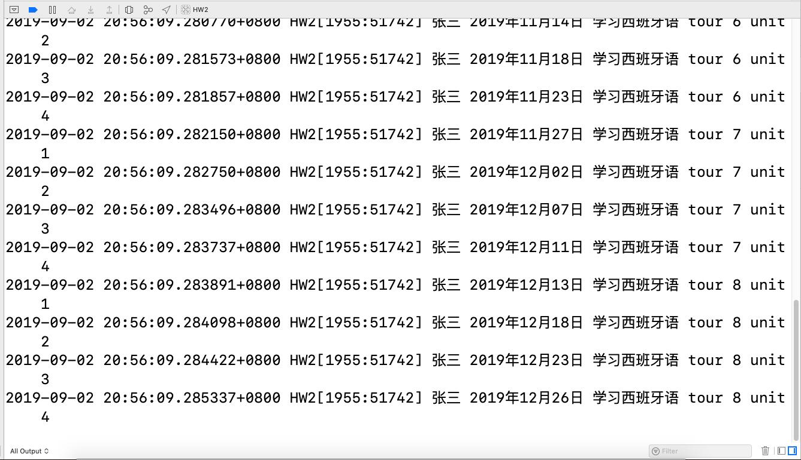
 

### 实验心得

这次实验是第二次写Objective C的程序，如果说第一次是照葫芦画瓢，那么这一次多了许多自己的想法。但是还有点疑惑的是写之前要像第一次那样删掉storyboard文件以及入口，这个是为什么呢？这一次写Objective C的程序，感受最深的是，其实它有很多地方跟C++是类似的，最大的不同点可能就是函数调用的写法不一样而已。现在的自己，对OC充满了好奇，希望自己在日后的课程能更深入地了解OC吧。