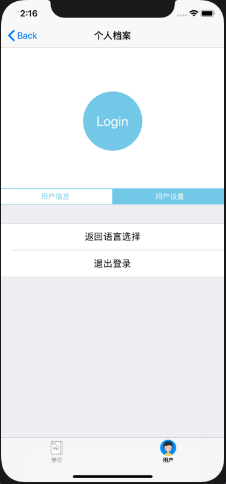

# 中山大学数据科学与计算机学院本科生实验报告

| 课程名称 | 现代操作系统应用开发 |   任课老师   |      郑贵锋      |
| :------: | :------------------: | :----------: | :--------------: |
|   年级   |         17级         | 专业（方向） |     软件工程     |
|   学号   |       17343036       |     姓名     |      郭章旭      |
|   电话   |     15692416866      |    Email     | 691215689@qq.com |
| 开始日期 |      2019-09-26      |   完成日期   |    2019-09-30    |


## 一、实验题目

### UI组件布局学习


## 二、实现内容

1. 学习使用纯代码进行UI布局
2. 学习UITableView, UICollectionView, UINavigationController, UITabBarController等组件的使用，以及delegate和protocol的概念

实现一个包含若干页面和子页面的"多语言学习App"，页面如下：

|            初始页面            |          语言学习页面          |
| :----------------------------: | :----------------------------: |
|         |         |
| 个人档案页面（用户信息子页面） | 个人档案页面（用户设置子页面） |
|         |         |

manual中有演示视频，要求如下：

1. 初始页面是应用启动后显示的第一个页面，用于选择语种，内容包括：
   - 一个UILabel，要求文字水平居中
   - 一个UICollectionView，包含四个Cells：
     - 每个Cell包含一个UIImageView和一个UILabel，要求用自定义的UICollectionViewCell实现
     - 四个Cell排布成两行，UICollectionView整体需要水平居中
     - 点击任意一个Cell，跳转到语言学习页面
2. 从初始页面跳转后进入到由一个UITabBarController组成的页面，其包含两个子页面"学习XX语"和"个人档案"：
   - 底部的TarBar包含两个按钮"学习"和"用户"，分别对应两个子页面，点击按钮切换到对应的页面
   - 按钮在选中和未选中状态下图片和文字的颜色都不同，参考示例图
3. "语言学习页面"包含一个UITableView：
   - TableView共包含8个Sections（对应八个tours），每个Section包含四个Rows（对应四个units）
   - 每个Section的Header显示"TOUR X"，每个Cell显示"unit X"
   - 顶部导航栏的标题根据首页所选的语言，显示"学习XX语"
4. "个人档案"页面包含一个UIButton，一个UISegmentedControl以及两个子页面：
   - UIButton为圆形，直径110，文字为"Login"，背景色可以自定，要求水平居中
   - UISegmentedControl包含两个items，"用户信息"和"用户设置"，点击切换到相应的子页面，主题色需要与上面的UIButton相同
   - "用户信息"和"用户设置"子页面都包含一个UITableView，均只有一个Section和两个Cells：
     - "用户信息"的TableView包含"用户名"和"邮箱"两个Cells，右侧显示"未登录"
     - "用户设置"的TableView包含"返回语言选择"和"退出登录"两个Cells，要求文字居中，点击"返回语言选择"时，跳回到初始页面
5. 需要用到的图片素材已在`manual/resoures`给出


## 三、实验结果

### (1)实验截图


### (2)实验步骤以及关键代码

按照实验要求以及TA给出的文件目录结构，创建以下文件：


​		其中NavigController负责将其他Controller压栈，或者将自己内部已有的Controller进行出栈，在这里我是直接继承UINavigationController，没做修改；LanguageViewController是对进入app的第一个界面进行管理；LanguageCell 继承于UICollectionViewCell，可以自定义CollectionViewCell的样式；LearningViewController实现的是对学习模块的管理，其中要实现的是tableView的委托和数据源管理；UserViewController是对个人档案界面的管理，里面就包含了SettingViewController和ProfileViewController的变量，SettingViewController管理设置界面（包括退出登录以及返回选择语言界面），ProfileViewController管理用户信息界面，最后TarBarController是用来管理学习模块界面和个人档案界面的。

##### LanguageCell（只说明一部分）：

```objective-c
 	_title = [[UILabel alloc] initWithFrame:CGRectMake(0, 0, 0, 0)];
	_title.textAlignment = NSTextAlignmentCenter;
	_title.textColor = [UIColor blackColor];
	[_title setFont: [UIFont systemFontOfSize: 18]];
	[self.contentView addSubview:_title];
	[_title mas_makeConstraints:^(MASConstraintMaker *make) {
		make.size.mas_equalTo(CGSizeMake(75, 75));
		make.centerX.equalTo(self.image);
		make.top.equalTo(self.image.mas_top).with.offset(-58);
	}];
```

​		这里用到了Masonry的API，将文字显示在图片顶部往上偏移58，文字框的大小设为长：75，宽：75，相对于照片居中。然后对于照片的处理也是类似，只不过调用make.centerX.equalTo的时候，是相对于self而言居中。


##### LearningViewController：

​		定义了一个UITableView的属性tableView，用来显示学习单元，tableView采取的是懒加载的方法：

```objective-c
- (UITableView *)tableView {
    if (!_tableView) {
        _tableView = [[UITableView alloc] initWithFrame:CGRectMake(0, 0, self.view.frame.size.width, self.view.frame.size.height - 0.06* self.view.frame.size.height) style:UITableViewStyleGrouped];
        _tableView.delegate =self;
        _tableView.dataSource = self;
        [self.tableView registerClass:[UITableViewCell class] forCellReuseIdentifier:@"ID"];
    }
    return _tableView;
}
```

​		还需要实现代理的方法：

```objective-c
//配置每个section(段）有多少row（行） cell
-(NSInteger)tableView:(UITableView *)tableView numberOfRowsInSection:(NSInteger)section{
    return 4;
}

//配置多个section
-(NSInteger)numberOfSectionsInTableView:(UITableView *)tableView{
    return 8;//8段
}


//每行显示什么东西
-(UITableViewCell *)tableView:(UITableView *)tableView cellForRowAtIndexPath:(NSIndexPath *)indexPath{
    //给每个cell设置ID号（重复利用时使用）
    NSString *cellID = [NSString stringWithFormat:@"Cell%ld%ld", indexPath.section, indexPath.row];
    
    //从tableView的一个队列里获取一个cell
    UITableViewCell *cell = [tableView dequeueReusableCellWithIdentifier:cellID];
    
    //判断队列里面是否有这个cell 没有自己创建，有直接使用
    if (cell == nil) {
        //没有,创建一个
        cell = [[UITableViewCell alloc]initWithStyle:UITableViewCellStyleDefault reuseIdentifier:cellID];
        
    }
    
    cell.textLabel.text = [NSString stringWithFormat:@"unit %ld", indexPath.row + 1];
    [tableView cellForRowAtIndexPath:indexPath].accessoryType = UITableViewCellAccessoryNone;
    //[tableView deselectRowAtIndexPath:indexPath animated:YES];
    return cell;
}
```

​		这三个是最基本的，其中每个cell的显示内容，我是根据它在每个section里的序号决定的，而每个section的头部内容，则是由section序号决定。为了使得点击会显示打勾，需要实现以下方法：

```objective-c
- (NSIndexPath *)tableView:(UITableView *)tableView willSelectRowAtIndexPath:(NSIndexPath *)indexPath {
    
    if([tableView cellForRowAtIndexPath:indexPath].accessoryType == UITableViewCellAccessoryCheckmark){
        [tableView cellForRowAtIndexPath:indexPath].accessoryType = UITableViewCellAccessoryNone;
    }
    else{
        [tableView cellForRowAtIndexPath:indexPath].accessoryType = UITableViewCellAccessoryCheckmark;
    }
    
    return indexPath;
    
}

//某个cell被点击
-(void)tableView:(UITableView *)tableView didSelectRowAtIndexPath:(NSIndexPath *)indexPath{
    //取消选择
    [tableView deselectRowAtIndexPath:indexPath animated:YES];
}

```

​		第一个方法实现的是，如果该cell没被打勾，就让它打勾，如果打勾了，就让它取消；然后第二个方法是为了实现点击完后，cell的显示不再是被点击时的状态。


##### ProfileViewController：

​		定义了一个UITableView的属性tableView，用来显示个人信息，以及定义了一个login的私有方法，这个方法实现的是，当点击Login按钮的时候，更改个人信息的显示。其中tableView采取的也是懒加载的方法。在这里tableView显示的是1个section2行的tableView，所以只需将上面给出的设置section和row的return值修改一下即可。然后这次的cell为了让它右侧也显示文字，所以其style要做修改：

​		`cell = [[UITableViewCell alloc]initWithStyle:UITableViewCellStyleValue1 reuseIdentifier:cellID];`

​		cell的显示内容修改成如下：

```objective-c
    if(indexPath.row == 0){
        cell.textLabel.text = @"用户名";
    }
    else{
        cell.textLabel.text = @"邮箱";
    }
    cell.detailTextLabel.text = @"未登录";
```

​		最后是login的方法：

```objective-c
-(void)login{
    self.tableView.visibleCells[0].detailTextLabel.text = @"Kwok_CheungYuk";
    self.tableView.visibleCells[1].detailTextLabel.text = @"691215689@qq.com";
}
```


##### SettingViewController：

​		用于显示“返回选择语言”和“退出登录”，所以也是定义了一个UITableView 的tableView，我还定义了字符串类型的isLog，用于判断当前用户是否登录了，如果登录，点击退出登录会有提示，否则没有。这里主要给出cell被点击的方法：

```objective-c
-(void)tableView:(UITableView *)tableView didSelectRowAtIndexPath:(NSIndexPath *)indexPath{
    if(indexPath.row == 0){
        //TODO
        [self.navigationController popToRootViewControllerAnimated:YES];
        NSLog(@"back");
    }
    if(indexPath.row == 1){
        if([self.isLog isEqualToString:@"YES"]){
            UIAlertController *alertController = [UIAlertController alertControllerWithTitle:@"登出成功" message:@"期待再见"preferredStyle:UIAlertControllerStyleAlert ];
            [self presentViewController:alertController animated:YES completion:nil];
            [self performSelector:@selector(dismiss:) withObject:alertController afterDelay:0.7];
            self.isLog = @"NO";
        }
    }
    //取消选择
    [tableView deselectRowAtIndexPath:indexPath animated:YES];
}
- (void)dismiss:(UIAlertController *)alert{
    [alert dismissViewControllerAnimated:YES completion:nil];
}
```

​		根据他们的行序号来执行不同的动作，如果是点击了“返回选择语言”的cell，则调用导航栏控件的方法：返回到根控制器。如果点击了“退出登录”则弹出消息，并把isLog设置为“NO”。


##### UserViewController：

​		包含了UISegmentedControl、UIButton控件、字符串类型的isLog，以及ProfileViewController、SettingViewController的实例leftTableVC、rightTableVC。

​		创建的函数不再细说，主要说一下怎么给按钮添加点击方法：

```objective-c
[self.btn addTarget:self action:@selector(btnClick:) forControlEvents:UIControlEventTouchUpInside];

-(void) btnClick:(id)sender
{
    if([_isLog isEqualToString:@"NO"]){
        UIAlertController *alertController = [UIAlertController alertControllerWithTitle:@"登录成功" message:@"欢迎回来"preferredStyle:UIAlertControllerStyleAlert ];
        [self presentViewController:alertController animated:YES completion:nil];
         [self performSelector:@selector(dismiss:) withObject:alertController afterDelay:0.7];
        [self.leftTableVC login ];
        _isLog = @"YES";
        _rightTableVC.isLog = _isLog;
    }
}

- (void)dismiss:(UIAlertController *)alert{
    [alert dismissViewControllerAnimated:YES completion:nil];
}
```

​		首先需要在创建按钮的地方增加一个action，方法名自定义，然后实现这个方法：根据自己的isLog来判断是否以及登录了，如果没登录，则弹出信息框，isLog设为“YES”，并把 _rightTableVC的isLog也设为“YES”，如果登录了，就不做任何处理。dismiss函数是用来处理信息框延迟多少秒消失的。

​		UISegmentedControl控件是切换`_leftTableVC`和`_rightTableVC`用的，在创建UISegmentedControl的时候也是添加一个change的方法：`[self.SC addTarget:self action:@selector(change:) forControlEvents:UIControlEventValueChanged];`然后实现这个change：

```objective-c
-(void)change:(UISegmentedControl *)sender{
    if (sender.selectedSegmentIndex == 0) {
        _leftTableVC.tableView.hidden = NO;
        _rightTableVC.tableView.hidden = YES;
        if([_rightTableVC.isLog isEqualToString:@"NO"]){
            _isLog = @"NO";
            [_leftTableVC.tableView reloadData];
        }
    }
    else if (sender.selectedSegmentIndex == 1){
        _rightTableVC.tableView.hidden = NO;
        _leftTableVC.tableView.hidden = YES;
    }
}
```

​		这里要注意，如果是从右边切换到左边的视图，需要判断一下`_rightTableVC.isLog`是不是为“NO”，如果是，则需要调用`[_leftTableVC.tableView reloadData];`来更新左边视图cell显示的数据。hidden函数是用作隐藏的。


##### TarBarController：

​		在实现了LearningViewController和UserViewController之后，就可以实现TarBarController了，常规地给tabBar添加viewController就不再细说了，这里主要说一下，点击不同的tab更改导航栏title的方法：

```objective-c
-(void)tabBarController:(UITabBarController *)tabBarController didSelectViewController:(UIViewController *)viewController{
    NSLog(@"%ld", viewController.tabBarItem.tag);
    if(viewController.tabBarItem.tag == 101){
        self.navigationItem.title = _lanTitle;
    }
    else if(viewController.tabBarItem.tag == 102){
        self.navigationItem.title = @"个人档案";
    }
}
```

​		给每个tab都设定了一个tag值，根据tab值来更改导航栏的标题。

​		TarBarController还包含了一个字符串类型的lanTitle，是用来确定当前的学习界面是学习那种语言的，这个变量在LanguageViewController中用到。


##### LanguageViewController：

​		LanguageViewController包含的东西比较多，四个TarBarController的变量，对于每一种语言；一个UICollectionView变量，用来显示首页的四个图标；一个UILabel变量，来显示“请选择语言”的字样。这里说明一下如何让这个页面的导航栏消失：

```objective-c
- (void)navigationController:(UINavigationController *)navigationController willShowViewController:(UIViewController *)viewController animated:(BOOL)animated {
    BOOL isShowHomePage = [viewController isKindOfClass:[self class]];
    
    [self.navigationController setNavigationBarHidden:isShowHomePage animated:YES];
}
```

​		首先判断当前显示的控制器是否是自己，如果是，则隐藏导航栏，否则不隐藏。

​		然后是实现collection cell的点击方法

```objective-c
-( void )collectionView:( UICollectionView *)collectionView didSelectItemAtIndexPath:( NSIndexPath *)indexPath{
    //TODO
    //TarBarController* temp = [[TarBarController alloc]init];
    self.navigationController.navigationBar.translucent = NO;
    if(indexPath.section == 0){
        if(indexPath.row == 0){
            [self.navigationController pushViewController: _en animated:YES];
        }
        else{
            [self.navigationController pushViewController: _ge animated:YES];
        }
    }
    else{
        if(indexPath.row == 0){
            [self.navigationController pushViewController: _jp animated:YES];
        }
        else{
            [self.navigationController pushViewController: _sp animated:YES];
        }
    }
}
```

​       我一开始的设想是只用一个TarBarController的temp，每次调用点击都新建，然后根据点击的cell的位置来决定这个temp的title，但是这样子做的缺点是每次返回主页面后再点击，之前的内容都会被清空。所以后来用用了四个TarBarController表示四种语言，这样子即使是返回主页面，再点进去相应的界面，已经勾选过的内容都不会消失，但缺点是比较占空间，暂时想不到更好的方法解决。


##### AppDelegate：

```objective-c
- (BOOL)application:(UIApplication *)application didFinishLaunchingWithOptions:(NSDictionary *)launchOptions {
    // Override point for customization after application launch.
    self.window = [ [UIWindow alloc] initWithFrame:[UIScreen mainScreen].bounds];

    
    LanguageViewController *rootView = [[LanguageViewController alloc] init];
    
    self.navController = [[NavigationController alloc] init];
    [self.navController pushViewController:rootView animated:YES];
    self.window.rootViewController = _navController;
    self.window.backgroundColor = [UIColor whiteColor];
    [self.window makeKeyAndVisible];
    return YES;
}
```

​		创建一个NavigationController的导航栏和LanguageViewController的控制器，然后将控制器push进入导航栏，作为导航栏的根视图，最后将window的根视图控制器设定为刚刚创建的导航栏即可。

### (3)实验遇到的困难以及解决思路

1. 一开始我点击“设置”中的“退出登录”以及“返回选择语言”完全没有反应，并且出现以下的错误提示：`Attempt to present <UIAlertController: 0x7fa749061a00> on <SettingViewController: 0x7fa748c5e530> whose view is not in the window hierarchy!`，上网搜索说是因为“是由于 "ViewController" 还没有被加载，就调用该 ViewController 或者 ViewController 内的方法”，但是我并不是很懂如何解决。我就再继续看了一下UserViewController的代码，原本对于添加左右视图的代码大致如下：

   ```objective-c
   -(void)addLeftTable{
       self.leftTableVC = [[ProfileViewController alloc]init];
       [self.view addSubview:self.leftTableVC.tableView];
       [self.leftTableVC.tableView mas_makeConstraints:^(MASConstraintMaker *make) {
           make.bottom.equalTo(self.SC.mas_bottom).with.offset(501);
           make.size.mas_equalTo(CGSizeMake(self.view.frame.size.width, 500));
       }];
   }
   ```

   后来我尝试在` [self.view addSubview:self.leftTableVC.tableView];`前面添加了一句 `[self addChildViewController:self.leftTableVC];`结果问题就迎刃而解了，但是具体原因不是很清楚。

2. 由于我是创建了4个TarBarController，因此对于UserViewController也拥有了四个，这样子就导致了在英语界面登录了，结果在其他界面还没有登录的问题。我本来的设想是想将UserViewController设计为单例模式，但是这样做之后，发现他不能在tabBar中显示了，后来在验收的时候问了TA这个问题，TA好像说是需要建立Model来管理UserViewController里面的数据，但不是很明白，因此这个问题也没有很好地解决，希望以后的课程上可以碰到这一类的讲解吧。

## 四、实验思考及感想

​		由于是初次使用object-c进行UI编程（好像也是大学第一次），所以我感觉特别地吃力，完成这个作业也用了挺长的时间，也需要在网上查找许多控件的知识点。但是当自己做完并能成功运行的时候，觉得超级开心。回想这几天，也学到了挺多知识。编程是真的熟能生巧，一开始对于Masonry的调用也不是很理解，到了后来写得越来越快，知道如何调整相对位置。最后，希望以后的作业要是包含了这么多文件，希望TA可以给出一个文件框架，说明一下每个文件实现哪些功能，这样子写起来，可能会更加清晰点。

