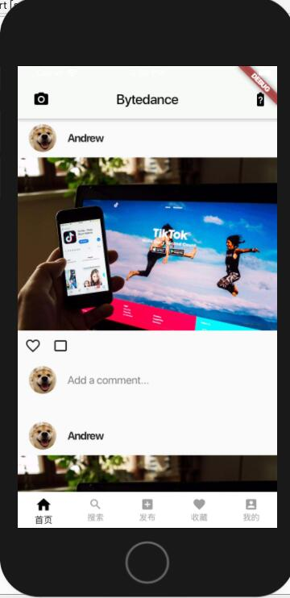
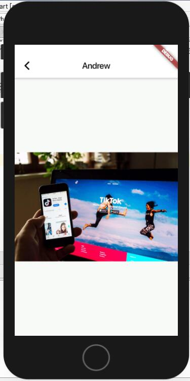
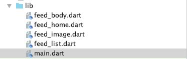

# 中山大学数据科学与计算机学院本科生实验报告
| 课程名称 | 现代操作系统应用开发 |   任课老师   |      郑贵锋      |
| :------: | :------------------: | :----------: | :--------------: |
|   年级   |         17级         | 专业（方向） |     软件工程     |
|   学号   |       17343036       |     姓名     |      郭章旭      |
|   电话   |     15692416866      |    Email     | 691215689@qq.com |
| 开始日期 |      2019-10-13      |   完成日期   |    2019-10-14    |


## 一、实验题目

### Flutter UI组件布局学习

#### 实验目的

1. 学习使用Flutter进行UI布局
2. 学习StatelessWidget, ListView, Container, BottomAppBar, Row, Padding等组件的使用，以及MethodChannel和Navigation的概念

## 二、实现内容

使用Flutter实现一个包含一个feed流页面的"社交App"，主页面如下：

 


初始页面是应用启动后显示的第一个页面，可以上下滑动查看feed流。

  1. 初始页面顶部是一个AppBar。

  - AppBar左边是一个摄像机Icon，要求距离左边12px边距，Icon图片使用Flutter自带的Icons.camera_alt，不需要加点击事件。
  - AppBar右边是一个电量Icon组件和Text组件。距离右边12px边距，Icon图片使用Flutter自带的Icons.battery_unknown，点击事件在加分项里另说，如果不做加分项，AppBar右边这两个组件可以不用做。
  - AppBar中间有一个Text，要求居中，文案为Helo.

2. 初始页面主体为一个ListView，ListView固定有六个Cell。每个Cell的样式都是相同的，要求必须复用。

  - Cell上面有一个头像Image组件和昵称Text组件。头像图案使用manual文件夹里面的dog.jpeg。
  - 所有边距都可以用16px或者10px来处理。
  - Cell中间是一张图片，图片是manual文件夹里面的timg.jpeg。
  - Cell图片下面是一个点赞按钮和评论按钮，点击事件不用做。点赞图案使用Flutter自带的Icons.favorite_border，评论图案使用Flutter自带的Icons.crop_3_2。
  - Cell最下面是一个头像组件和一个文本框输入组件TextField。

3. 页面最下边是一个BottomAppBar组件，BottomAppBar里面用Row布局组件放五个Icon。分别是Icons.home，Icons.search，Icons.add_box，Icons.favorite，Icons.account_box。点击事件不用做。

## 三、实验结果

### (1)实验截图






### (2)实验步骤以及关键代码

​		首先本次项目由五个文件组成，分别是：**main.dart**、**feed_home.dart**、**feed_body.dart**、**feed_image.dart**、**feed_list.dart**、



​		按照我个人的理解，feed_home界面代表的是带有底部Bar的界面；feed_body是首页，包含一个Navigator以及feed_list；feed_list显示每条动态的内容；feed_image界面是指点击照片后进入的界面。

**main.dart**：

```dart
home: BotomeMenumBarPage()
```

构造一个带有底部导航栏的界面，并设置成App的home界面。


**feed_home.dart**：

```dart
class BotomeMenumBarPage extends StatefulWidget {
  ////通过构造方法传值
  BotomeMenumBarPage();

  //主要是负责创建state
  @override
  BotomeMenumBarPageState createState() => BotomeMenumBarPageState();
}
```

这一个类的代码与给出的模板基本一致，然后再创建一个BotomeMenumBarPageState类来实现bulid函数

```dart
class BotomeMenumBarPageState extends State<BotomeMenumBarPage> {
  ......
  @override
  Widget build(BuildContext context) {
    //构建页面
    return buildBottomTabScaffold();
  }
  //当前显示页面的
  int currentIndex = 0;
  //点击导航项是要显示的页面
  final pages = [
    ChildItemView("首页"),
    ......
  ];

  Widget buildBottomTabScaffold() {
    return SizedBox(
        height: 100,
        child: Scaffold(
          //对应的页面
          body: pages[currentIndex],
          bottomNavigationBar: BottomAppBar(
            notchMargin: 6.0,
            color: Colors.white,
            child: Row(
              mainAxisSize: MainAxisSize.max,
              mainAxisAlignment: MainAxisAlignment.spaceAround,
              children: <Widget>[
                buildBotomItem(currentIndex, 0, Icons.home, "首页"),
                ......
              ],
            ),
          ),
        ));
  }


  buildBotomItem(int selectIndex, int index, IconData iconData, String title) {
    //未选中状态的样式
    ......
	//选中状态
    if(selectIndex==index){
      ......
    }
    Widget padItem = SizedBox();
    if (iconData != null) {
      ......
    }
    Widget item = Expanded(
      ......
    );
    return item;
  }
}
```

```dart
class ChildItemView extends StatefulWidget {
  String _title;

  ChildItemView(this._title);

  @override
  _ChildItemViewState createState() => _ChildItemViewState();
}

class _ChildItemViewState extends State<ChildItemView> {
  @override
  Widget build(BuildContext context) {
    if(widget._title == "首页"){
      return Container(
        //child: Center(child: Text(widget._title)),
          child: Center(
              child: MyBodyPage(title: 'Bytedance')
          )
      );
    }
    else{
      return Container(
        child: Center(child: Text(widget._title)),
      );
    }
  }
}
```

BotomeMenumBarPageState类我是在网上找到模板做修改的，就没什么好说的了。在创建子页面的时候，我判断了一下页面的title，如果是首页的话，就建立MyBodyPage的界面，其他界面没有完成所以只显示了文字。


**feed_body.dart**：

body界面首先建立一个顶部导航栏：

```dart
appBar: AppBar(......
        ),
```

然后body是显示feed_list的内容。


**feed_list.dart**：

这一部分很多都是直接调用组件来搭建一个cell，我觉得最重要的是以下的代码：

```dart
InkWell(
                child: Image.asset("images/timg.jpeg"),
                onTap: () {
                  Navigator.push(context, MaterialPageRoute(builder:
                      (context) => MyImg(title:"Andrew")));
                },
              ),
```

显示的图片是在InkWell里面，InkWell可以添加动作，比如onTap就是单击，单击之后执行的代码就是将MyImg界面push到导航栏中，这样子就会显示feed_image的界面了。


**feed_list.dart**：

```dart
return Scaffold(
        backgroundColor: Color(0xFFf8faf8),
        appBar: AppBar(title: Text(widget.title, style: TextStyle(color: Colors.black)),
          backgroundColor: Colors.white,
          leading: IconButton(icon: Icon(Icons.arrow_back_ios, color: Colors.black,), onPressed:() {Navigator.pop(context);}),
        ),
        body: Center(
            child: Image.asset("images/timg.jpeg"),
        )  // This trailing comma makes auto-formatting nicer for build methods.
    );
```

创建导航栏，其实如果这里如果不是将导航栏的颜色变成偏向白色，顶部导航栏的写法可以不用这么复杂。然后body是居中的一张图片。

### (3)实验遇到的困难以及解决思路

1. 顶部导航栏的返回Icon颜色问题：由于顶部导航栏的颜色我是根据TA给出的图片来设置的，而返回Icon默认的颜色是白色，这就导致了看不清返回的图标，暂时我还不知道如何修改默认图标的颜色，因此只能在创建导航栏的时候传入以下参数：

   ```dart
   leading: IconButton(icon: Icon(Icons.arrow_back_ios, color: Colors.black,), onPressed:() {Navigator.pop(context);}),
   ```

   这样子就可以把返回按钮变成黑色了，当然我不知道这个按钮和默认的返回按钮图案是不是一样的，只是找了个比较相同的，由于自定义了leading的Icon，因此还要自定义方法onPressed，方法很简单，就是调用导航栏的Pop函数就好了。

2. 在创建list的每个cell中，评论的地方一开始我打算是在row中加入头像，加入TextFiled就好了，结果死活显示不了TextFiled，而且它还不报错......后来网上查了一下存在的问题，结果发现row不能直接加入TextFiled，要用Expanded的方法去加入：

   ```dart
   child: new Row(
                     children: <Widget>[
                       Container(
                         margin: EdgeInsets.only(left:16.0,right: 16),
                         height: 40.0,
                         width: 40.0,
                         decoration: new BoxDecoration(
                           shape: BoxShape.circle,
                           image: new DecorationImage(
                               fit: BoxFit.fill,
                               image: new AssetImage(
                                   "images/dog.jpeg")),
                         ),
                       ),
                       Container(
                         child: new  Expanded(child: TextField(decoration: InputDecoration(hintText: "Add a comment...", border: InputBorder.none,))),
                       ),
                     ],
                   ),
   ```

   

## 四、实验思考及感想

​		有了上一次实验布局的基础，这次的布局比较简单，但是难点就是需要用一门新的语言去构建。一开始看着TA给出的目录结构是一脸懵逼的，但后来仔细看了一下演示的视频，还是有了点眉目。后来就是不断在网上搜索每个组件的使用方法，一步一步改模板，然后就把整个框架写好了。这过程我觉得最难的就是ListView的构建，一开始我找到的模板是return ListTail（就也为只能返回ListTail类型），但发现ListTail并不符合每个Cell的要求，后来自己大胆的试了一下return Container，发现可行，就一切好办了。

​		完成本次实验后有了这样一个疑惑：既然用Flutter框架可以实现代码跨平台使用，为什么还需要专门去学Object-C呢？OC只能写出适合IOS的代码，那用OC写的APP，不得还需要再写一次别的语言来适配安卓吗？这不是很麻烦？而且写IOS代码还得用Mac系统的Xcode，感觉好麻烦。

​		总的来说，通过本次实验，基本了解了dart语言的使用，对Flutter也有了一定的了解。

