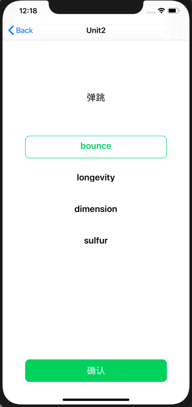

# 中山大学数据科学与计算机学院本科生实验报告
| 课程名称 | 现代操作系统应用开发 |   任课老师   |      郑贵锋      |
| :------: | :------------------: | :----------: | :--------------: |
|   年级   |         17级         | 专业（方向） |     软件工程     |
|   学号   |       17343036       |     姓名     |      郭章旭      |
|   电话   |     15692416866      |    Email     | 691215689@qq.com |
| 开始日期 |      2019-10-28      |   完成日期   |    2019-10-30    |


## 一、实验题目

### 网络访问与动画

#### 实验目的

1. 学习使用NSURLSession或AFNetworking库进行网络访问

2. 学习使用UIView动画及Core Animation动画

## 二、实现内容

实现一个简单的单词学习应用，页面如下：

|      初始页面       |     选择题页面      |
| :-----------------: | :-----------------: |
|  |  |
|      选择正确       |      选择错误       |
|  |  |
|      分数页面       |                     |
|  |                     |

manual中有演示视频，要求如下：

1. 初始页面是应用启动后显示的第一个页面，包含四个Unit选项（可以用CollectionView实现），要求：

   - 各选项水平居中，且内部的文字也水平居中
   - 每个选项的背景为圆角矩形，且背景色从左上角到右下角渐变（颜色可自选）

2. 点击任意Unit后，进入选择题界面。该页面每次显示一道题目，各选项垂直排列且水平居中。

   页面底部是一个UIButton，当没选中任何选项时，该按钮为灰色，不响应点击。

3. 当点击选中任意选项之后，该选项的文字变为绿色，且背景变为绿色的圆角矩形框，底部按钮的背景色也变为绿色。只能同时选中一个选项。

4. 点击底部"确认"按钮后，按钮文字变为"继续"，并且页面底部会弹出一个UIView，弹出动画的持续时间为0.5s。如果选项正确，则弹出的UIView背景色为绿色；若选项不正确，则背景色为红色，同时按钮的颜色也相应地变为红色（UIView的背景色与按钮的背景色需要有区别，建议用RGB值实现）。UIView的左上角显示正确答案。

5. 点击"继续"按钮后，底部UIView向下移动收回，动画持续时间0.5s。然后将页面上显示的题目替换为下一道。

6. 完成所有题目后，点击"继续"，进入分数界面，显示正确题数。

7. 题目信息的获取和选项的判断都需要通过访问网络API实现。该API中的题目共分四个Unit，每个Unit有四道题目，每个题目包含一个中文描述和四个英文单词选项。

### 加分项

1. 在分数界面添加四个五角星⭐️图片，并在进入该界面时添加动画。

   - 进入该界面时，分数显示为"0"。各五角星均为空心。

   - 各五角星从左到右依次执行放大缩小的动画，每个五角星的动画持续时间为0.5s

- 每个五角星对应一道题目，当该题目选择正确时，五角星在动画执行完后变为实心，且分数加1
  - 参考manual中的演示视频


## 三、实验结果

### (1)实验截图

|     初始页面     |    选择题页面    |
| :--------------: | :--------------: |
|  |  |
|     选择正确     |     选择错误     |
|  |  |
|     分数页面     |                  |
|  |                  |

### (2)实验步骤以及关键代码

首先本次项目主要由六个部分组成，分别是：**UnitCell**、**ChoiceCell**、**NavigationController**、**UnitViewController**、**QuestionViewController**、**FinishingViewController**：


其中，**UnitCell**和**ChoiceCell**继承于UICollectionViewCell，分别用于在选择单元界面和回答问题界面；**NavigationController**用于自定义顶部导航栏，继承于UINavigationController；**UnitViewController**用于显示选择单元的界面；**QuestionViewController**用于显示问答界面；**FinishingViewController**用于显示得分界面。

这次实验的重点是对于网络编程的熟悉以及动画的使用。我首先是用TA在manual给出的GET代码来获取了某一个单元的数据，进行分析：

```json
 (
        (
                {
            choices =             (
                America,
                China,
                Spanish,
                English
            );
            question = "\U4e2d\U56fd";
        },
                {
            choices =             (
                "In America",
                "In Phone",
                "In China",
                InComputer
            );
            question = "\U5728\U7f8e\U56fd";
        },
                {
            choices =             (
                beef,
                bear,
                bean,
                beam
            );
            question = "\U725b\U8089";
        },
                {
            choices =             (
                channel,
                chapter,
                chance,
                change
            );
            question = "\U673a\U4f1a";
        }
    )
)

```

可以看到服务器返回的数据转换成字典格式后，包含一个数组A，数组A中仅有一个数组B，数组B中有4个字典，每个字典包含两个**key**：**question**和**choices**。**question**为一个汉字字符串，**choices**为一个数组，包含了四个选项。这个分析在后面获取每一题的问题的时候会用到。


**UnitCell**： 要求使用渐变效果，关键代码如下：

```objective-c
 CAGradientLayer *gradientLayer =  [CAGradientLayer layer];
        gradientLayer.frame = CGRectMake(0, 0, 200, 55);
        gradientLayer.startPoint = CGPointMake(0, 0);
        gradientLayer.endPoint = CGPointMake(1, 1);
        gradientLayer.locations = @[@(0.0),@(1.0)];
        [gradientLayer setColors:@[(id)[[UIColor blueColor] CGColor],(id)[[UIColor greenColor] CGColor]]];
```

frame指定这个CAGradientLayer的起始位置以及大小；startPoint指定渐变的开始点，endPoint指定渐变的终止点，两个结合起来可以指定渐变的方向，此处的坐标取值范围是[0, 1]；locations指定颜色分割的位置，第一个参数0.0代表第一个颜色的终止地方，第二个参数1.0是第二个颜色的开始地方，0.0~1.0是渐变的部分。setColors指定layer的颜色。创建完渐变的layer后，只需调用`[xxView.layer addSublayer:gradientLayer];`就可以展示渐变效果了。


**UnitViewController**：最重要的部分是改写选中cell的方法：

```objective-c
-( void )collectionView:( UICollectionView *)collectionView didSelectItemAtIndexPath:( NSIndexPath *)indexPath{
    //TODO
    _questionVC = [[QuestionViewController alloc]init];
    _questionVC.title = [NSString stringWithFormat:@"Unit%ld",indexPath.section + 1];
    _questionVC.currentUnit = indexPath.section;
    _questionVC.currentQuestion = 0;
    [self.navigationController pushViewController: _questionVC animated:YES];
    self.navigationController.navigationBar.translucent = YES;
    
}
```

根据选中cell的indexPath.section，给QuestionViewController类型的questionVC赋值title以及questionVC对应的单元，以便发出Get请求获取数据。


**QuestionViewController**：可以说是本程序的灵魂所在。

首先是从服务器Get数据：

```objective-c
dispatch_semaphore_t semaphore = dispatch_semaphore_create(0);

    NSMutableURLRequest *request = [NSMutableURLRequest requestWithURL:[NSURL URLWithString:[NSString stringWithFormat: @"https://service-p12xr1jd-1257177282.ap-beijing.apigateway.myqcloud.com/release/HW5_api?unit=%lu", self.currentUnit]]];

    [request setHTTPMethod:@"GET"];

    NSString *appStartRequestStr = [NSString stringWithFormat:@""];

    [request setHTTPBody:[appStartRequestStr dataUsingEncoding:NSUTF8StringEncoding]];

    NSURLSession *urlSession = [NSURLSession sharedSession];
    NSURLSessionDataTask *urlSessionDataTask = [urlSession dataTaskWithRequest:request completionHandler:^(NSData * _Nullable data, NSURLResponse * _Nullable response, NSError * _Nullable error)

    {
        if(error == nil)
        {
            NSDictionary *dic = [NSJSONSerialization JSONObjectWithData:data options:NSJSONReadingAllowFragments error:&error];
            NSArray *list = dic.allValues;
            //NSLog(@"data = %@",dic);
            self->_question = [((NSDictionary*)list[0][self->_currentQuestion]) objectForKey:@"question"];
            self->_choices = [((NSDictionary*)list[0][self->_currentQuestion]) objectForKey:@"choices"];
           
        }
        dispatch_semaphore_signal(semaphore);

    }];

    [urlSessionDataTask resume];
    dispatch_semaphore_wait(semaphore, DISPATCH_TIME_FOREVER);
```

关键之处在于<font color=red>使用信号量</font>来同步获取数据，否则无法将对于的数据显示在对于的cell上，原因是如果不使用信号量，则获取数据会在子线程执行，主线程继续往下执行，这时候还没有获取到数据，因此cell也得到对于的数据。其中**_question**和**_choices**都是NSArray类型。**list**变量得到的是整个数据，在上面的分析可以得知**list**仅有一个元素，是一个数组。再根据现在是第几个问题获取对应的字典，然后调用字典的函数**objectForKey**来获取对应的问题和选项。


然后是向服务器Post数据：

首先看一下Post后返回得到的数据格式：

```json
正确：
{
	"message": "right",
	"data": "domestic"
}

错误：
{
	"message": "wrong",
	"data": "domestic"
}
```

返回的数据转换成字典后，得到的是有两个key的字典，message的值代表post的答案是否正确，data的值表示正确答案。

POST的时候同样是需要使用信号量来同步获取数据，代码与上面GET的代码类似，不同点在于对于GET的代码：`[request setHTTPMethod:@"GET"];`方法，这里需改成POST，以及**NSString *appStartRequestStr**不在是空，而是要填入数据（下面用**jsonString**表示）：

```objective-c
NSDictionary *dic = @{@"unit": [NSString stringWithFormat: @"%lu", _currentUnit],
                          @"question": [NSString stringWithFormat: @"%lu", _currentQuestion],
                          @"answer": _answer};
    NSError *error = nil;
    NSData *jsonData = [NSJSONSerialization dataWithJSONObject:dic options:NSJSONWritingPrettyPrinted error:&error];
    NSString *jsonString = [[NSString alloc] initWithData:jsonData encoding:NSUTF8StringEncoding];
```


然后是用于显示答案的view的动画，代码如下：

```objective-c
[UIView animateWithDuration:0.5 delay:0 options:UIViewAnimationOptionBeginFromCurrentState animations:^ {
            CGRect screenBounds = [[UIScreen mainScreen] bounds];
            self->_display.transform = CGAffineTransformTranslate(self->_display.transform, 0, -screenBounds.size.height * 0.3);
        } completion:^(BOOL finished) {
                        
        }];
```

这里的意思是，x轴方向位置不改变，y轴方向减去0.3的屏幕高度，也就是往上移动，这个动画持续时间是0.5秒，延迟是0。

将view往下移动很简单，只需将**-screenBounds.size.height * 0.3**的-号删去即可。


然后是点击了**继续按钮**之后的处理：

如果当前问题的计数小于3，则：

需要把**确定按钮**的背景色换回灰色。对于刷新cell的数据我是这样子写的：

```objective-c
 _currentQuestion ++;
[self GetAllData];
[_collectionView reloadData];
[_titleLabel setText:[NSString stringWithFormat: @"%@", _question]];
```

将当前问题加1，然后重新从服务器GET数据，最后调用reloadData来刷新cell，并且再把显示问题的label更改文字。

若当前问题的计数大于3，则显示得分界面。


**FinishingViewController**：关键之处是关键帧动画：

```objective-c
-(void)BeginAnimation{
    for(int i = 0; i < [_Stars count]; i ++){
        [UIView animateKeyframesWithDuration:1 delay:0.5 +i options:UIViewKeyframeAnimationOptionCalculationModeLinear animations:^{
            [UIView addKeyframeWithRelativeStartTime:0 relativeDuration:0.5 animations: ^{
                // key frame 0
                ((UIImageView*)self->_Stars[i]).transform = CGAffineTransformMakeScale(2, 2);
            }];
            [UIView addKeyframeWithRelativeStartTime:0.5 relativeDuration:0.5 animations: ^{
                // key frame 1
                ((UIImageView*)self->_Stars[i]).transform = CGAffineTransformMakeScale(1, 1);
            }];
        } completion:^(BOOL finished) {
            if( [self->_totalRight[i] isEqual:@"right"]){
                [(UIImageView*)self->_Stars[i] setImage:[UIImage imageNamed:@"Star1.png"]];
                self->_correctNum ++;
                [self->_displayNum setText:[NSString stringWithFormat:@"%d", self->_correctNum]];
            }
        }];
    }
}
```

初始化完之后，就遍历存放星星的数组，给每一个星星都加入一个关键帧动画：在动画时间的0.0处，开始将星星放大到原来的两倍，持续时间是动画时间的0.5；在动画时间的0.5处，星星开始缩小回原来大小，持续时间是动画时间的0.5。每一个星星动画的延迟根据0.5 + i来定，这样子就可以让星星从左到右一个一个的放大缩小。每个星星播放完动画后，判断对应位置的**totalRight**数组，这个数组存放了四道题的对错情况，根据对于位置的对错，来决定给不给星星变成实心。

### (3)实验遇到的困难以及解决思路

1. 在使用GET方法的时候，一开始忘记了是异步调用的，发现在给cell赋值之前输出一下对于的值都是null。后来想起来了，就使用信号量来同步获取数据，但是如果用的是TA给出的GET代码，添加信号量之后会卡死不动，不知道是原因：

   ```objective-c
   __block dispatch_semaphore_t semaphore = dispatch_semaphore_create(0);
       //发起一个get请求
       NSURLSessionConfiguration *defaultConfigObject = [NSURLSessionConfiguration defaultSessionConfiguration];
       NSURLSession *delegateFreeSession =[NSURLSession sessionWithConfiguration:defaultConfigObject delegate:self delegateQueue:[NSOperationQueue mainQueue]];
   
       NSURL *url = [NSURL URLWithString:[NSString stringWithFormat: @"https://service-p12xr1jd-1257177282.ap-beijing.apigateway.myqcloud.com/release/HW5_api?unit=%lu", self.currentUnit]];
       NSURLRequest *request = [NSURLRequest requestWithURL:url];
       __block NSArray *list;
       NSURLSessionDataTask *dataTask = [delegateFreeSession dataTaskWithRequest:request
                                                                completionHandler:^(NSData *data, NSURLResponse *response, NSError *error) {
           if(error == nil){
               NSDictionary *dic = [NSJSONSerialization JSONObjectWithData:data options:NSJSONReadingAllowFragments error:&error];
               list = dic.allValues;
                   //[self setDate:((NSDictionary*)list[0][1])];
           }
           
           dispatch_semaphore_signal(semaphore);
       }];
       [dataTask resume];
       dispatch_semaphore_wait(semaphore, DISPATCH_TIME_FOREVER);
       NSLog(@"%@", list[0][1]);
   ```

   后来我是使用了TA给出的POST请求的模板来改成GET方法，才解决了这个问题。

2. 对于回答完一道问题后的界面刷新，会保留上一题的选中，然后我就想办法取消选中，在输入des后XCode给了我这样一个补全的函数：` [_collectionView deselectItemAtIndexPath:_select animated:YES]; `但是发现并没有什么用。后来询问TA后，得知可以在 cellForItemAtIndexPath代理函数里面处理 。刷新界面的时候，会调用cellForItemAtIndexPath，因此只需要在cellForItemAtIndexPath中将每个cell的边框宽度设为0即可。

## 四、实验思考及感想

​		通过本次实验，基本掌握了网络编程以及动画的使用方法。我觉得对于网络编程这一部分来说，最重要的是对数据进行分析，这次的数据格式虽说比较简单，但是一开始我还是看得有点眼花缭乱，只能通过逐步逐步试错来得到最终的结论。而对于动画的使用，则需要掌握Xcode所提供的方法以及组件的属性才能熟悉地调用。在本次实验开始前，本以为会很简单，基本与HW3类似，但写起来却发现虽然有一些类似，但也有挺多改动的地方。本次实验除了让我们熟悉掌握网络编程以及动画以外，更让我对于UI编程有进一步的了解。

