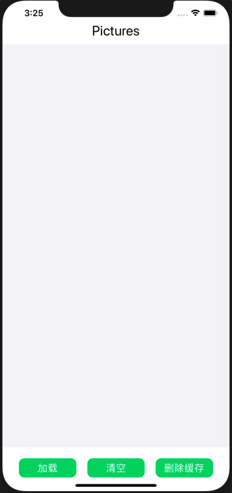
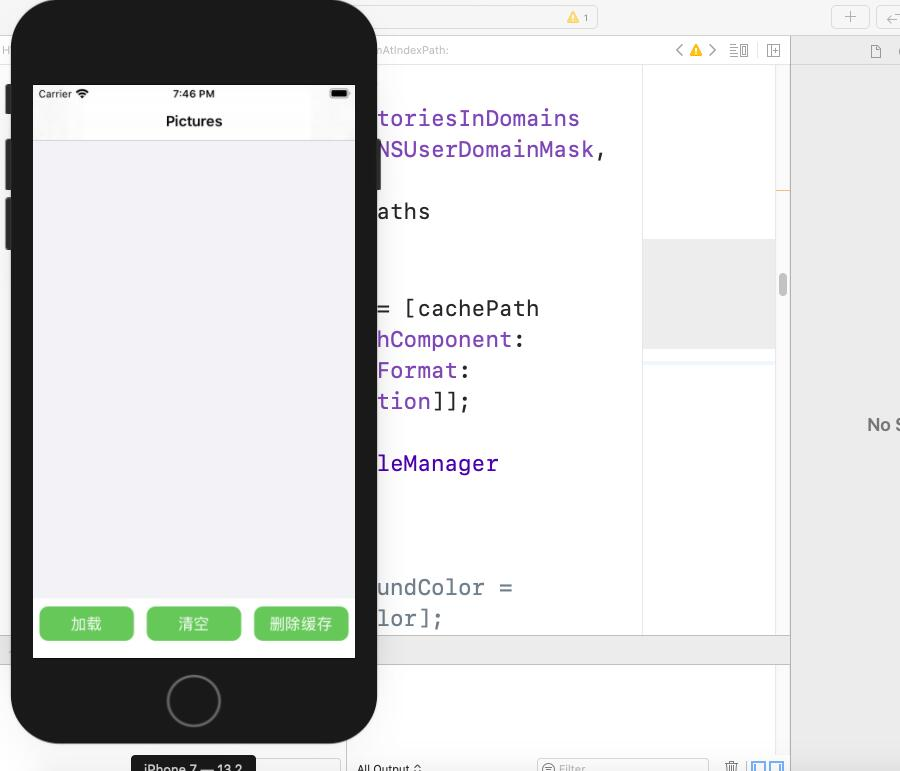
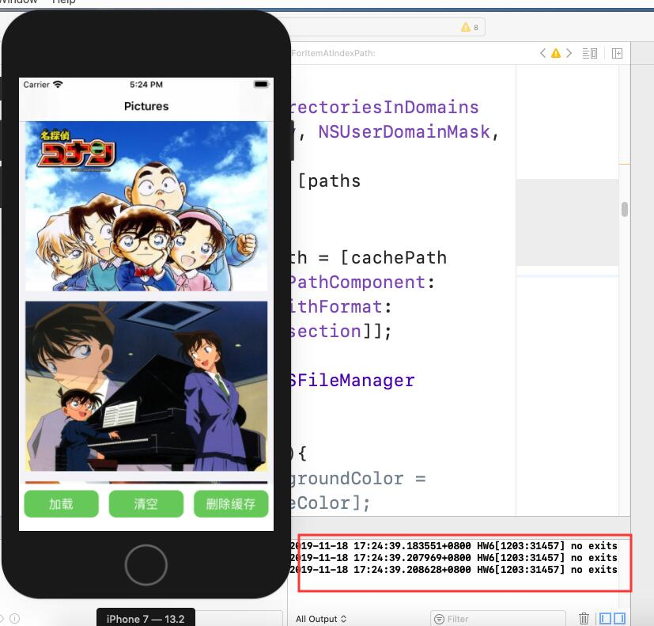
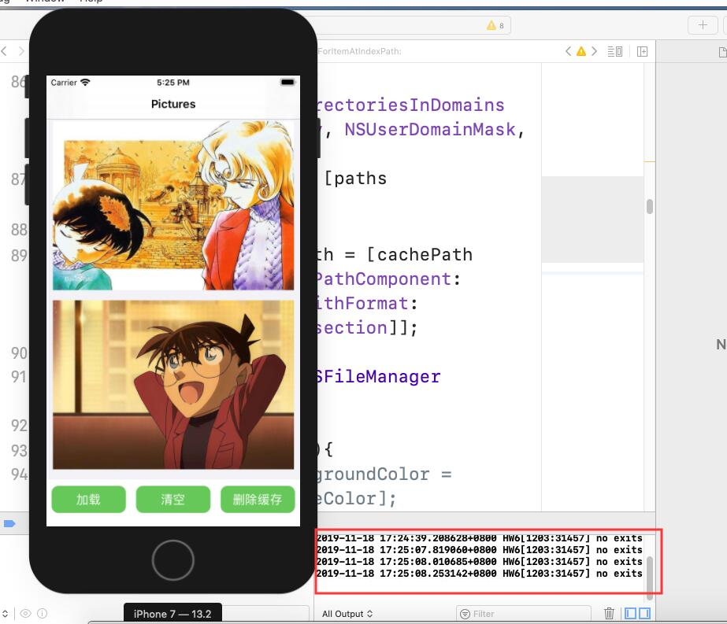
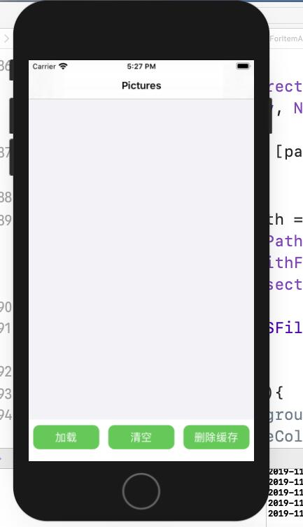
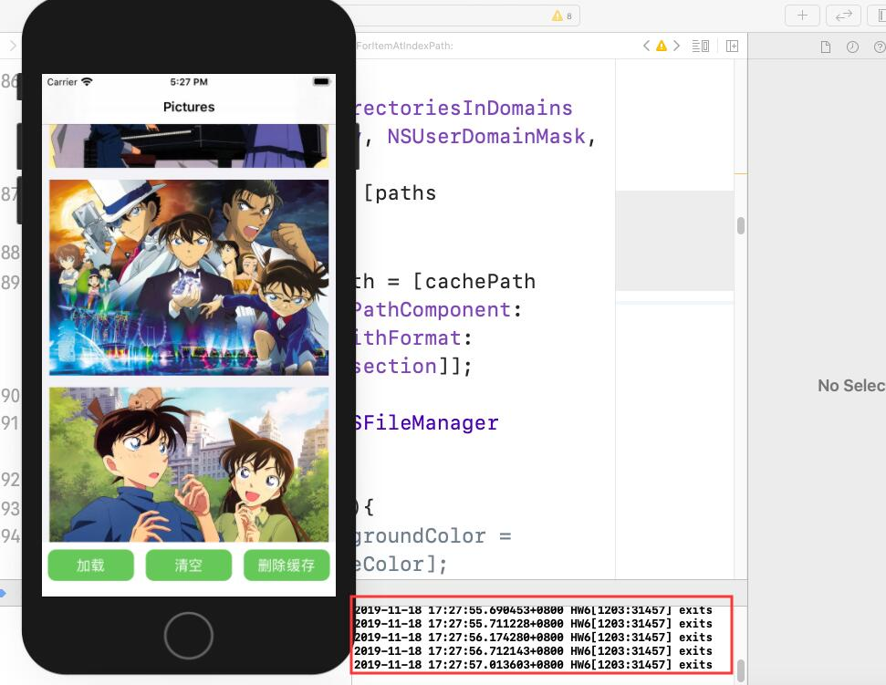
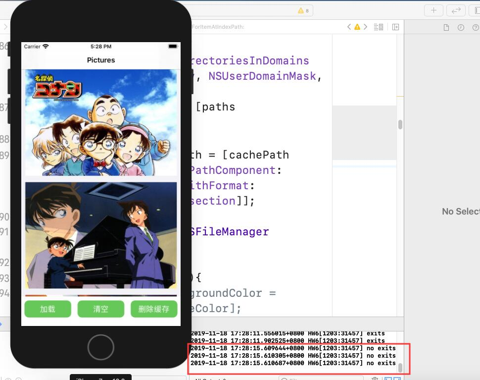
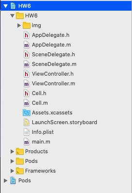

# 中山大学数据科学与计算机学院本科生实验报告
| 课程名称 | 现代操作系统应用开发 |   任课老师   |      郑贵锋      |
| :------: | :------------------: | :----------: | :--------------: |
|   年级   |         17级         | 专业（方向） |     软件工程     |
|   学号   |       17343036       |     姓名     |      郭章旭      |
|   电话   |     15692416866      |    Email     | 691215689@qq.com |
| 开始日期 |      2019-11-16      |   完成日期   |    2019-11-18    |


## 一、实验题目

### 多线程与本地存储

#### 实验目的

1. 学习使用NSOperation或GCD进行多线程操作
2. 学习iOS沙盒机制，进行文件读写操作

## 二、实现内容

实现一个简单的单词学习应用，页面如下：

|    初始状态     |    加载图片     |
| :-------------: | :-------------: |
|  |  |

manual中有演示视频，要求如下：

1. 只有一个页面，包含一个Label，一个图片列表（可以用UICollectionView或UITableView），以及三个按钮（"加载" "清空" "删除缓存"）。

2. 点击"加载"按钮，若Cache中没有缓存的文件，则加载网络图片并显示在图片列表中，要求：
   - 在子线程下载图片，返回主线程更新UI
   - 图片下载完成前，显示loading图标
   - 图片下载后，存入沙盒的Cache中
3. 点击"加载"按钮，若Cache中已存在图片文件，则直接从Cache中读取出图片并显示。
4. 点击"清空"按钮，清空图片列表中的所有图片。
5. 点击"删除缓存"按钮，删除存储在Cache中的图片文件。


## 三、实验结果

### (1)实验截图

#### 初始化界面




#### 第一次点击加载





可以看到图片的加载执行的是**no exits**部分的代码

#### 点击清空后再次点击加载





可以看到图片的加载执行的是**exits**部分的代码


#### 点击删除缓存后再次点击加载



图片的加载又一次执行**no exits**部分的代码。

### (2)实验步骤以及关键代码

文件目录结构组成如下：



**Cell**主要用来自定义CollectionViewCell来显示图片，其余都在**ViewController**中实现。

Cell继承了UICollectionViewCell，有一个UIImageView用来显示加载的图片变量image，这个变量的ContentMode我设置成了UIViewContentModeRedraw，即尺寸改变时重绘。其余实现与之前的基本一致，只是简单的定位一下位置、尺寸，不再叙述。这次作业最核心的就是如何多线程加载图片以及将图片数据写入到沙盒中。

多线程加载图片，我是用GCD来来实现的。

首先定义了一个dispatch_queue_t 类型私有变量downloadQueue和NSMutableArray的urls，downloadQueue用来实现多线程加载图片，urls存放这加载图片的网络地址。

downloadQueue初始化为并行队列。


```objective-c
-(void)LoadData{
    _clickLoad = true;
    _clickClear = false;
    [_collectionView reloadData];
    
}
```

当加载按钮被点击的时候，首先将bool变量clickLoad设为true，clickClear设为false，这两个变量是用在cellForItemAtIndexPath函数中，判断执行什么内容。当clickLoad为真的时候，执行加载图片，当clickClear为真的时候，清空图片。


```objective-c
//获取沙盒cache路径
NSArray *paths = NSSearchPathForDirectoriesInDomains(NSCachesDirectory, NSUserDomainMask, YES);
NSString *cachePath = [paths objectAtIndex:0];
// 图片的路径
NSString *imageFilePath = [cachePath stringByAppendingPathComponent:[NSString stringWithFormat: @"%lu",indexPath.section]];

NSFileManager* fm= [NSFileManager defaultManager];
```

首先是获取到cache的路径，然后再添加上图片的名字，我这里用每个cell的indexPath.section（0、1、2......）表示不同的图片。接着获得文件管理器。


```objective-c
if([fm fileExistsAtPath:imageFilePath] == NO){
    NSLog(@"no exits");
    [cell.image setImage:[UIImage imageNamed:@"loading.png"]];
    dispatch_async(_downloadQueue,^{
        NSURL *url = [NSURL URLWithString:[NSString stringWithFormat: @"%@",self->_urls[indexPath.section]]];
        NSData*imageData=[NSData dataWithContentsOfURL:url];
        dispatch_async(dispatch_get_main_queue(),^{
            [cell.image setImage:[UIImage imageWithData:imageData]];
            [UIImageJPEGRepresentation([UIImage imageWithData:imageData], 1.0) writeToFile:imageFilePath  atomically:YES];
        });
    });
}
```

接着调用文件管理器的fileExistsAtPath函数去寻找给定的图片路径是否存在，如果不存在，就将获取图片的任务加入到downloadQueue队列中，当获取数据完成后，通知主线程，更新对于Cell的UI显示，并且调用图片写入函数将图片写入到沙盒的路径中去。


```objective-c
else{
    NSLog(@"exits");
    [cell.image setImage:[UIImage imageWithContentsOfFile:imageFilePath]];
}
```

当所需要的图片存在的时候，直接读沙盒中的图片即可。


```objective-c
if(_clickClear == true){
[cell.image setImage:nil];
}
```

然后如果是点击了清空按钮，只需要将每个cell的image显示的照片设为nil即可。


```objective-c
-(void)DeleteCache{
    _clickLoad = false;
    _clickClear = false;
    //获取沙盒cache路径
    NSArray *paths = NSSearchPathForDirectoriesInDomains(NSCachesDirectory, NSUserDomainMask, YES);
    NSString *cachePath = [paths objectAtIndex:0];
    NSFileManager* fm= [NSFileManager defaultManager];
    for(int i = 0; i < [_urls count]; i ++){
        NSString *imageFilePath = [cachePath stringByAppendingPathComponent:[NSString stringWithFormat: @"%d",i]];
        [fm removeItemAtPath:imageFilePath error:nil];
    }
}
```

最后是点击删除缓存的按钮，遍历每个图片的路径，调用removeItemAtPath函数将其从沙盒中删除。

### (3)实验遇到的困难以及解决思路

这次实验比较简单，没有遇到什么困难，但由于其他作业比较多，就没有完成加分项。

## 四、实验思考及感想

​		通过本次实验，基本掌握了多线程GCD的使用方法以及沙盒文件读写的方法。了解了沙盒的工作原理之后，就觉得沙盒对于每个app来说都是很好的存在。 每个App都必须待在自己的沙盒里，其他应用不能访问该沙盒。所有的非代码文件都要保存在此，例如属性文件plist、文本文件、图像、图标、媒体资源等。 这就保证了系统的安全性以及App与App之间的安全性。当然并不是说其他App不能访问不属于自己的沙盒，如果想访问，就需要访问权限。就好像微信第一次想访问相册，会弹出授权是否允许来供用户选择。

