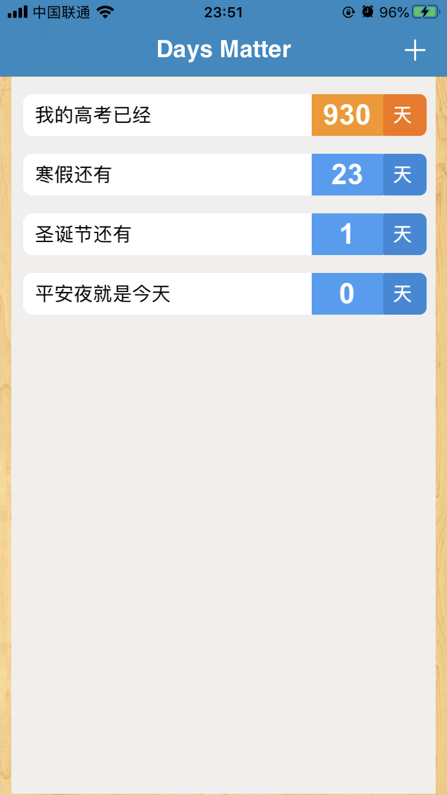

# 中山大学数据科学与计算机学院本科生实验报告

## （2019年秋季学期）

| 课程名称 | 现代操作系统应用开发 |   任课老师   |      郑贵锋      |
| :------: | :------------------: | :----------: | :--------------: |
|   年级   |         17级         | 专业（方向） |     软件工程     |
|   学号   |       17343036       |     姓名     |      郭章旭      |
|   电话   |     15692416866      |    Email     | 691215689@qq.com |
| 开始日期 |       2019-12        |   完成日期   |     2020-01      |


## 一、实验题目

## 期末项目——日常(TimeTo)APP开发

---

## 二、实现内容

### 本人负责的应用的实现部分：

    1.仿制了倒数日(Days Matter)的主要功能，包括：
    	-导航栏色彩功能设置
    	-主页面：显示所有用户记录的事件
    	-详细页面：显示某一个事件的详细日期
    	-添加事件页面：用于添加事件
    2.制作UITabBarController的样式，用于整合

---

## 三、实验结果

### (1)实验截图

#### 主页面：



#### 详情页面：


#### 事件添加页面：


#### 时间过了一天后的主页面：


### (2)实验步骤以及关键代码

#### 基本描述

我实现功能的文件目录组成如下：


其中，**Entry+CoreDataxxxx**四个文件是通过在**DayMatters.xcdatamodeld**中定义实体和实体拥有的属性后生成的，用于将每个字段的唯一ID，事件内容和事件时间保存到数据库中。**Cell**继承自UICollectionViewCell，只要用于显示主页的每条记录，**HomePageController**用于管理主页的内容及操作，**AddPageController**用于管理添加事件界面的内容及对应的添加操作，**DetailPageController**用于管理点击每个cell后进入的界面的内容及对应的删除操作。

#### 关键代码说明

##### Cell

cell有以下6个属性：

```objective-c
@property int ID;
@property (strong, nonatomic)MyUILabel *content;
@property (strong, nonatomic)UILabel *time;
@property (strong, nonatomic)UILabel *day;
@property (strong, nonatomic)NSDate *concreteTime;
@property BOOL isPast;
```

其中ID对应的是数据库里某一条记录的ID，content用于显示记录的内容，time显示还剩多少天，day显示"天"，concreteTime用于保存这条记录的具体时间，isPast表示这条记录是还未发生还是已经发生了。content我用的是自定义的UILabel，原因是因为系统的UILabel对于里面的文字排列方式只有居左居中居右，其中的居左居右都非常靠近Label的边框，所以自己定义了一个MyUILabel类，重写**drawTextInRect**的方法，让文字居左的时候，也可以离label的边框远一点，具体代码如下：

```objective-c
- (void)drawTextInRect:(CGRect)rect {
//文字距离上下左右边框都有10单位的间隔
CGRect newRect = CGRectMake(rect.origin.x + 10, rect.origin.y + 10, rect.size.width - 20, rect.size.height -20);

[super drawTextInRect:newRect];

}
```

然后Cell的代码都是对UI的编辑排列，这里就不详细说了。


##### HomePageController

HomePageController要做的事情，首先是改变导航栏的样式，初始化数据库，获取数据库中的数据，以及完成CollectionView的布局管理，这里许多的方法都是以前作业常用到的，唯一比较新的就是对CoreData的运用了，老师的课件也给出了详细的代码，所以写起来不算很难，代码如下：

```objective-c
//创建数据库
- (void)createSqlite{
    
    //1、创建模型对象
    //获取模型路径
    NSURL *modelURL = [[NSBundle mainBundle] URLForResource:@"DayMatters" withExtension:@"momd"];
    //根据模型文件创建模型对象
    NSManagedObjectModel *model = [[NSManagedObjectModel alloc] initWithContentsOfURL:modelURL];
    
    //2、创建持久化存储助理：数据库
    //利用模型对象创建助理对象
    NSPersistentStoreCoordinator *store = [[NSPersistentStoreCoordinator alloc] initWithManagedObjectModel:model];
    
    //数据库的名称和路径
    NSString *docStr = [NSSearchPathForDirectoriesInDomains(NSDocumentDirectory, NSUserDomainMask, YES) lastObject];
    NSString *sqlPath = [docStr stringByAppendingPathComponent:@"coreData.sqlite"];
    NSLog(@"数据库 path = %@", sqlPath);
    NSURL *sqlUrl = [NSURL fileURLWithPath:sqlPath];
    NSError *error = nil;
    //设置数据库相关信息 添加一个持久化存储库并设置存储类型和路径，NSSQLiteStoreType：SQLite作为存储库
    [store addPersistentStoreWithType:NSSQLiteStoreType configuration:nil URL:sqlUrl options:nil error:&error];
    
    if (error) {
        NSLog(@"添加数据库失败:%@",error);
    } else {
        NSLog(@"添加数据库成功");
    }
    
    //3、创建上下文 保存信息 操作数据库
    
    _objContext = [[NSManagedObjectContext alloc] initWithConcurrencyType:NSMainQueueConcurrencyType];
    
    //关联持久化助理
    _objContext.persistentStoreCoordinator = store;
}
```

创建完数据库后，从数据库中获取记录：

```objective-c
NSFetchRequest *request = [NSFetchRequest fetchRequestWithEntityName:@"Entry"];
    NSArray *resArray = [_objContext executeFetchRequest:request error:nil];
_objDataSource = [NSMutableArray arrayWithArray:resArray];
```

将所有记录都保存在类型为NSMutableArray的objDataSource中，后续用来给每个cell显示内容。

这里值得注意的是由于记录的数量是不确定的，所以在代理方法返回多少个分区中，返回的是objDataSource的长度：

```objective-c
//返回分区个数
-(NSInteger)numberOfSectionsInCollectionView:(UICollectionView *)collectionView{
    return _objDataSource.count;
}
```

在返回每个item的函数中，首先是根据indexPath.section获取对应的一条记录，然后将记录的id，具体时间和记录内容赋值到cell上，然后再与当前时间进行比较，记录上的时间点是已经过去了或是今天还是未来，根据不同条件，去显示不同的颜色，以及举动cell的content内容显示的是“XXX还有”、“XXX就是今天”、“XXX已经”。实现代码如下：

```objective-c
//返回每个item
- (Cell *)collectionView:(UICollectionView *)collectionView cellForItemAtIndexPath:(NSIndexPath *)indexPath {
    Cell *cell = (Cell *)[collectionView dequeueReusableCellWithReuseIdentifier:@"cellId" forIndexPath:indexPath];
    //TODO:从数据库获取数据赋值给cell
    NSDate *date1 = [NSDate date];
    NSDateFormatter *dateFormatter = [[NSDateFormatter alloc] init];
    [dateFormatter setDateFormat:@"yyyy-MM-dd"];
    NSMutableString *dateStr = [NSMutableString stringWithString: [dateFormatter stringFromDate:date1]];
    NSDate *curDate = [dateFormatter dateFromString:dateStr];
    Entry* entry = _objDataSource[indexPath.section];
    cell.ID = entry.id;
    cell.concreteTime = entry.time;
    
    //利用NSCalendar比较日期的差异
    NSCalendar *calendar = [NSCalendar currentCalendar];
    /**
     * 要比较的时间单位,常用如下,可以同时传：
     *    NSCalendarUnitDay : 天
     *    NSCalendarUnitYear : 年
     *    NSCalendarUnitMonth : 月
     *    NSCalendarUnitHour : 时
     *    NSCalendarUnitMinute : 分
     *    NSCalendarUnitSecond : 秒
     */
    NSCalendarUnit unit = NSCalendarUnitDay;//只比较天数差异
    //比较的结果是NSDateComponents类对象
    NSDateComponents *delta = [calendar components:unit fromDate:curDate toDate:cell.concreteTime options:0];
    NSInteger dayInt = delta.day;
    if(delta.day >= 0){
        cell.isPast = false;
    }
    else{
        cell.isPast = true;
        dayInt = -dayInt;
    }
    cell.time.text = [[NSString alloc]initWithFormat:@"%lu",dayInt];
    if(cell.isPast == false){
        //倒数
        //设置颜色
        cell.day.backgroundColor = [UIColor colorWithRed:44.0/255.0 green:137.0/255.0 blue:217.0/255.0 alpha:1.0];
        cell.time.backgroundColor = [UIColor colorWithRed:63.0/255.0 green:158.0/255.0 blue:245.0/255.0 alpha:1.0];
        //设置显示的内容
        if(delta.day == 0){
            cell.content.text = [[NSString alloc]initWithFormat:@"%@%@",entry.title,@"就是今天"];
        }
        else{
            cell.content.text = [[NSString alloc]initWithFormat:@"%@%@",entry.title,@"还有"];
        }
    }
    else{
        //正数
        //设置颜色
        cell.day.backgroundColor = [UIColor colorWithRed:246.0/255.0 green:116.0/255.0 blue:0.0/255.0 alpha:1.0];
        cell.time.backgroundColor = [UIColor colorWithRed:249.0/255.0 green:148.0/255.0 blue:19.0/255.0 alpha:1.0];
        //设置显示的内容
        cell.content.text = [[NSString alloc]initWithFormat:@"%@%@",entry.title,@"已经"];
    }
    return cell;
}
```

接着是点击每个Cell的函数，点击每个cell，显示详情页面，思路就是直接把整个cell传过去给DetailPageController：

```objective-c
//UICollectionViewCell被选中时调用的方法
-( void )collectionView:( UICollectionView *)collectionView didSelectItemAtIndexPath:( NSIndexPath *)indexPath{
    //TODO
    NSLog(@"cell%lu clicked",indexPath.section);
    Cell *cell = (Cell *)[collectionView cellForItemAtIndexPath:indexPath];
    DetailPageController *d1 = [[DetailPageController alloc]init];
    [d1 initData:cell withContext:_objContext];
    [self.navigationController pushViewController:d1 animated:YES];
}
```

最后就是给导航栏添加右上角按键，以及对应的方法：

```objective-c
UIBarButtonItem* rightButtonItem = [[UIBarButtonItem alloc]initWithBarButtonSystemItem:UIBarButtonSystemItemAdd target:self
    action:@selector(addButtonClicked)];
[rightButtonItem setTintColor:[UIColor whiteColor]];
self.navigationItem.rightBarButtonItem = rightButtonItem;

-(void)addButtonClicked{
    NSLog(@"add entry");
    AddPageController *add = [[AddPageController alloc]init];
    [add initDB:_objContext withSource:_objDataSource];
    [self.navigationController pushViewController:add animated:true];
}
```


##### AddPageController

主要由几个UIView，UIImageView，UILabel等组成，这里还有本学期第一次使用的UIDatePicker，它可以显示一个时间选择控件，让用户去选择时间。UIDatePicker我觉得最重要的就是去监听滚动，当发生滚动的时候，需要去更改某个UILabel显示的时间，函数如下：

```objective-c
//首先在初始化的时候给UIDatePicker添加监听滚动的函数
[_datePicker addTarget:self action:@selector(dateChange:) forControlEvents:UIControlEventValueChanged];

//然后实现dateChange这个函数
- (void)dateChange:(UIDatePicker *)datePicker {
    //设置时间格式
    NSDateFormatter *formatter = [[NSDateFormatter alloc] init];
    formatter.dateFormat = @"yyyy-MM-d";

    NSString *dateStr = [formatter  stringFromDate:datePicker.date];
    _selectDate = [formatter dateFromString:dateStr];
    NSString *weekStr = [self weekdayStringFromDate:datePicker.date];
    NSMutableString *resultStr = [[NSMutableString alloc]initWithFormat:@"%@   %@", dateStr, weekStr];
    _timeLabel.text = resultStr;
}
```

显示时间的时候，除了显示到天外，原版的Days Matter还显示了星期几，因此我也参考了一下网上给出的由日期计算周几的代码，仿着写了一个：

```objective-c
//计算星期
-(NSString*)weekdayStringFromDate:(NSDate*)inputDate {
    
    NSArray *weekdays = [NSArray arrayWithObjects: [NSNull null], @"星期日", @"星期一", @"星期二", @"星期三", @"星期四", @"星期五", @"星期六", nil];
    
    NSCalendar *calendar = [[NSCalendar alloc] initWithCalendarIdentifier:NSGregorianCalendar];
    
    NSTimeZone *timeZone = [[NSTimeZone alloc] initWithName:@"Asia/Shanghai"];
    
    [calendar setTimeZone: timeZone];
    
    NSCalendarUnit calendarUnit = NSWeekdayCalendarUnit;
    
    NSDateComponents *theComponents = [calendar components:calendarUnit fromDate:inputDate];
    
    return [weekdays objectAtIndex:theComponents.weekday];
    
}
```

最后是保存的动作，保存的实现要将数据存入到数据库中，首先是新建一个实体变量表示添加，然后将对应的id，用户输入的内容和选择时间都传给实体变量，最后执行数据库的save，将刚刚创建的实体变量的信息保存到数据库：

```objective-c
-(void)saveButtonClicked{
    _conceretDate = _selectDate;
    Entry * entry = [NSEntityDescription
    insertNewObjectForEntityForName:@"Entry"
    inManagedObjectContext:_objContext];
    entry.id = (int)_objDataSource.count;
    while(true){
        bool curIdExist = false;
        for(Entry *e in _objDataSource){
            if(e.id == entry.id){
                curIdExist = true;
                entry.id ++;
                break;
            }
        }
        if(curIdExist == false){
            break;
        }
    }
    if([_contentTextField.text  isEqual: @""]){
        entry.title = @"某天";
    }
    else{
        entry.title = _contentTextField.text;
    }
    entry.time = _conceretDate;
    //   3.保存插入的数据
    NSError *error = nil;
    [_objContext save:&error];
    [self.navigationController popViewControllerAnimated:YES];
}
```


##### DetailPageController

基本都是UI布局，最重要的就是删除函数的实现，这里删除数据库对应的记录，用的是唯一的ID，删除之后一定要记得执行save命令，否则并不能真正从数据库中删除。

```objective-c
-(void)delButtonClicked{
    NSLog(@"delete");
    //创建删除请求
    NSFetchRequest *deleRequest = [NSFetchRequest fetchRequestWithEntityName:@"Entry"];
    //删除条件
    NSPredicate *pre = [NSPredicate predicateWithFormat:@"id == %d", _cell.ID];
    deleRequest.predicate = pre;
    //返回需要删除的对象数组
    NSArray *deleArray = [_objContext executeFetchRequest:deleRequest error:nil];
    //从数据库中删除
    for (Entry *e in deleArray) {
        [_objContext deleteObject:e];
    }
    NSError *error = nil;
    [_objContext save:&error];
    
    [self.navigationController popViewControllerAnimated:YES];
}
```


### (3)实验遇到的困难以及解决思路

1. 由于主页面和详情页面的导航栏样式不一样，所以在详情页面加载的时候又重新设置了一下导航栏的属性，结果发现返回主页面的时候导航栏样式并没有变回去，即使是在主页面的viewWillAppear函数再次调用设置导航栏样式的方法也没有改变。后来发现是因为在详情页面的时候，为了让导航栏透明显示，设置了一个空背景图，而主页面的设置导航栏样式的方法没有用到设置背景图的方法，所以一直显示透明，后来我在详情页面的viewWillDisappear方法中，将导航栏背景图还原为空就好了:

   ```objective-c
   - (void)viewWillDisappear:(BOOL)animated{
   
       [super viewWillDisappear:animated];
       
       //还原导航栏设置
       [self.navigationController.navigationBar setBackgroundImage:nil forBarMetrics:UIBarMetricsDefault];
       [self.navigationController.navigationBar setShadowImage:nil];
       [self.navigationController.navigationBar setTitleTextAttributes:@{NSForegroundColorAttributeName : [UIColor whiteColor],
       NSFontAttributeName : [UIFont fontWithName:@"Helvetica-Bold" size:20]}];
   }
   ```

2. 在功能全都实现好测试好之后，无意间发现有时候会出现删除某个记录结果删除掉两个记录的情况。我就判定是因为每个记录的ID肯定是出现了重复。因此重新审查给记录赋值ID的代码，原本代码中，ID是用数据库记录的个数来赋值的，在测试的时候发现出现上述情况的原因：当不是删除最后一条记录之后，数据库记录的个数就减了1，然后再重新添加一条新纪录的时候，这条新纪录的ID和最后一条记录的ID是一样的，这就导致了如果删除这两条记录的其中一条，会把另外一条也删除。后来我给记录赋值ID的时候，还检查了一下在数据库中的记录是否有用到这个ID，有的话ID加一后再进行检查，直到没有重复为止：

   ```objective-c
   entry.id = (int)_objDataSource.count;
   while(true){
       bool curIdExist = false;
       for(Entry *e in _objDataSource){
           if(e.id == entry.id){
               curIdExist = true;
               entry.id ++;
               break;
           }
       }
       if(curIdExist == false){
           break;
       }
   }
   ```

   3.当显示的天数大于一万的时候，内容会以省略的形式出现，导致这个问题的原因是UILabel太小了，因此后来加了一个逻辑判断，如果大于1万，字体变小一点：

   ```objective-c
   if(dayInt < 10000){
       cell.time.font =  [UIFont fontWithName: @"Arial-BoldMT" size:24];
   }
   if(dayInt >= 10000 && dayInt < 100000){
       cell.time.font =  [UIFont fontWithName: @"Arial-BoldMT" size:20];
   }
   else if(dayInt >= 100000){
       cell.time.font =  [UIFont fontWithName: @"Arial-BoldMT" size:16];
   }
   ```

   

---

## 四、实验思考及感想

---

​		在开始这次大实验之前，觉得会是一个很大的难题。但是当小组确定下来要做什么项目，分好工之后，就一步一步地实现自己要实现的功能，写完下来感觉也没什么难的。这次的实验，基本综合了之前所有所学到的内容，因此只要之前的作业有认真写的话，这次实验分配到的任务不算太难，UIVeiwlCollection，动画等代码基本都是用之前的框架，只需要修改一下里面的内容即可。在这次实验中，用到的新知识具体来说，就只有两个：一是UIDatePicker的使用；二是数据库CoreData的运用。这些知识有的上课老师也讲过，网上也有很详细的资料，因此想要实现自己想要的功能也不是很难。

​		通过这次实验，再一次意识到了小组合作的重要性，比如我们这次的APP，要是全部功能都由一个人完成，肯定要做很长时间。但是通过小组分工之后，每个人实现一部分的功能，完成时间大大减少了。但我们这次的小组项目其实也不算太完美，比如整体上来说，每个人实现的功能，基本都是独立的，与其他人实现的功能互不相干，不能体现协同开发。

​		最后，经过了一整个学期的系统学习，自己对IOS编程有了一定程度的了解。感谢这一个学期里老师的悉心教导，以及感谢TA的耐心答疑。听说IOS开发这门课是我们这一届才有的，总体效果来讲，内容十分丰富，也谢谢老师可以请到字节跳动的大牛们给我们传授知识。希望这一门课可以越办越好！